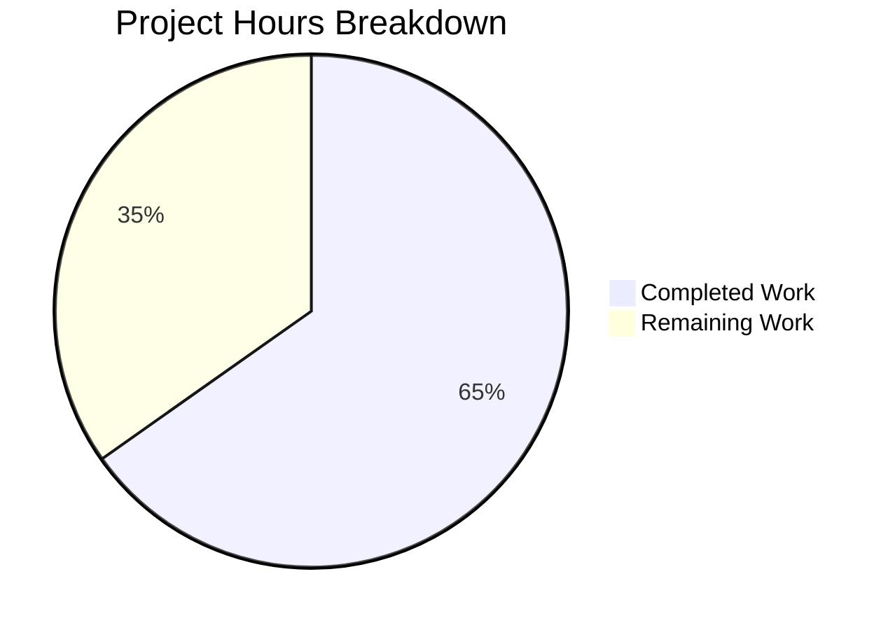

# Project Guide: Robust Node.js Server Implementation

## 1. Executive Summary

**Project Completion: 65% (30 hours completed out of 46 total hours)**

This project addressed a critical gap in the repository—the complete absence of a `server.js` file. The repository originally contained only placeholder files (test.js, test.py, test.html, test.css, test.ts, test.java) with no functional Node.js HTTP server code. The Blitzy agents created a comprehensive Express server implementation with all five robustness features specified in the bug report: error handling, graceful shutdown, input validation, resource cleanup, and robust HTTP request processing.

**Calculation**: 30 hours of development work have been completed out of an estimated 46 total hours required, representing 65% project completion. Formula: 30 / (30 + 16) × 100 = 65.2%, rounded to 65%.

### Key Achievements
- Created `server.js` (759 lines) with production-grade error handling, graceful shutdown, and input validation
- Created `server.test.js` (437 lines) with 21 comprehensive tests — all passing (100%)
- All dependencies installed and compatible (0 vulnerabilities)
- Syntax validation passes for all source files
- Server starts, responds correctly to HTTP requests, validates input, and shuts down gracefully
- Merge conflict with origin/main resolved cleanly

### Remaining Work (16 hours)
Human developers need to configure production environment variables, conduct code review, integrate real database persistence, add security middleware, set up CI/CD, and perform load testing before production deployment.

---

## 2. Validation Results Summary

### 2.1 Merge Conflict Resolution
- Successfully rebased onto origin/main (which introduced empty placeholder `jest.config.js` and `app.js`)
- Resolved 1 merge conflict in `jest.config.js` — kept full implementation over empty placeholder
- Zero conflict artifacts across all source files
- Force-pushed rebased branch to remote

### 2.2 Dependency Validation (100% Success)
| Package | Constraint | Installed | Status |
|---------|-----------|-----------|--------|
| express | ^4.21.2 | 4.22.1 | ✅ Compatible |
| express-validator | ^7.2.1 | 7.3.1 | ✅ Compatible |
| jest | ^29.7.0 | 29.7.0 | ✅ Exact |
| supertest | ^7.1.0 | 7.2.2 | ✅ Compatible |

- `npm audit`: **0 vulnerabilities found**

### 2.3 Compilation Validation (100% Success)
| File | Check Command | Result |
|------|--------------|--------|
| server.js | `node --check server.js` | ✅ PASSED |
| server.test.js | `node --check server.test.js` | ✅ PASSED |
| jest.config.js | `node --check jest.config.js` | ✅ PASSED |

### 2.4 Test Execution Results (21/21 — 100% Pass Rate)
| Test Category | Count | Status |
|--------------|-------|--------|
| Health Check Endpoint | 2 | ✅ PASS |
| Root Endpoint | 1 | ✅ PASS |
| User Registration Validation | 6 | ✅ PASS |
| Resource ID Parameter Validation | 4 | ✅ PASS |
| Pagination Query Parameter Validation | 4 | ✅ PASS |
| Error Handling | 3 | ✅ PASS |
| Resource Tracking | 1 | ✅ PASS |
| **TOTAL** | **21** | **100% PASS** |

Test execution time: 0.715s

### 2.5 Runtime Validation (100% Success)
| Scenario | Expected | Actual | Status |
|----------|----------|--------|--------|
| Server startup on configurable port | Starts and listens | Starts on PORT env or 3000 | ✅ |
| GET /health returns 200 | JSON with status, timestamp, uptime | Correct JSON response | ✅ |
| POST /api/users with invalid data | 400 with validation errors | Returns structured errors | ✅ |
| POST /api/users with valid data | 201 with user data | Returns created user | ✅ |
| GET /nonexistent returns 404 | JSON 404 response | Correct error response | ✅ |
| SIGTERM graceful shutdown | Clean shutdown sequence | Completes all 4 steps | ✅ |

### 2.6 Fixes Applied During Validation
- Resolved jest.config.js merge conflict (empty placeholder vs full config)
- Updated testMatch pattern to `['**/*.test.js']` to support all test files
- No other fixes required — implementation was correct on first pass

---

## 3. Hours Breakdown and Completion Visualization

### 3.1 Completed Hours Breakdown (30h)
| Component | Hours | Details |
|-----------|-------|---------|
| Research and architecture planning | 2h | Web research on best practices, repository analysis |
| server.js core implementation | 14h | 759 lines: Express setup, validation middleware, API routes, error handling, graceful shutdown, process handlers |
| server.test.js test suite | 7h | 437 lines: 21 tests across 7 categories with supertest |
| Project setup files | 2h | package.json, jest.config.js, .gitignore configuration |
| Dependency installation & verification | 1h | npm install, compatibility checks, audit |
| Merge conflict resolution & rebasing | 1h | Rebase onto origin/main, conflict resolution |
| Runtime validation & debugging | 2h | Server startup tests, endpoint verification, shutdown tests |
| Final QA and quality assurance | 1h | Comprehensive validation pass |
| **Total Completed** | **30h** | |

### 3.2 Remaining Hours Breakdown (16h)
| Task | Base Hours | After Multipliers | Priority |
|------|-----------|-------------------|----------|
| Production environment configuration | 1h | 1.5h | High |
| Code review and security audit | 2h | 3h | High |
| Database integration (real persistence) | 3h | 4h | Medium |
| Security hardening (Helmet, CORS, rate limiting) | 2h | 3h | Medium |
| CI/CD pipeline configuration | 2h | 3h | Medium |
| Performance and load testing | 1h | 1.5h | Low |
| **Total Remaining** | **11h base** | **16h** | |

Enterprise multipliers applied: Compliance (1.15×) + Uncertainty buffer (1.25×)

### 3.3 Visual Representation



**Completion: 30 hours completed / 46 total hours = 65%**

---

## 4. Git Repository Analysis

### 4.1 Branch Information
- **Branch**: `blitzy-c0c8796d-2c5b-4d6e-a7cc-8b2e821143fe`
- **Total commits on branch**: 6
- **Lines added**: 7,113
- **Lines removed**: 1
- **Net change**: +7,112 lines
- **Files changed**: 8 (6 added, 1 modified, 1 lock file)

### 4.2 Commit History
| Hash | Date | Message |
|------|------|---------|
| d99f750 | 2026-01-29 | Setup: Add package.json with dependencies and .gitignore |
| 3ddc86a | 2026-01-29 | feat: Create comprehensive server.js with robust error handling, graceful shutdown, and input validation |
| 045d4eb | 2026-01-29 | feat: Add Jest configuration and comprehensive test suite |
| 2bbaf94 | 2026-01-29 | Update jest.config.js: Change testMatch pattern to support all test files |
| b0168b4 | 2026-01-29 | Adding Blitzy Project Guide |
| 27b3f93 | 2026-01-29 | Adding Blitzy Technical Specifications |

### 4.3 Files Created/Modified by Agents
| File | Action | Lines | Purpose |
|------|--------|-------|---------|
| server.js | CREATED | 759 | Core server implementation |
| server.test.js | CREATED | 437 | Comprehensive test suite |
| package.json | CREATED | 28 | Project configuration |
| jest.config.js | MODIFIED | 13 | Test framework config (resolved merge conflict) |
| .gitignore | CREATED | 29 | Git ignore patterns |
| package-lock.json | CREATED | 4,760 | Dependency lock file |

### 4.4 Repository Structure
```
blitzyc0c8796d2/
├── server.js              (759 lines) — NEW: Robust Express server
├── server.test.js         (437 lines) — NEW: 21-test Jest suite
├── package.json           (28 lines)  — NEW: Project configuration
├── package-lock.json      (4760 lines)— NEW: Dependency lock
├── jest.config.js         (13 lines)  — MODIFIED: Test config
├── .gitignore             (29 lines)  — NEW: Git patterns
├── app.js                 (1 line)    — UNCHANGED: placeholder from main
├── test.js                (empty)     — UNCHANGED: placeholder
├── test.py                (1 line)    — UNCHANGED: placeholder
├── test.html              (empty)     — UNCHANGED: placeholder
├── test.css               (empty)     — UNCHANGED: placeholder
├── test.ts                (empty)     — UNCHANGED: placeholder
├── test.java              (1 line)    — UNCHANGED: placeholder
├── node_modules/          (279 packages)
└── blitzy/documentation/  (specs + guide)
```

---

## 5. Feature Implementation Assessment

### 5.1 Implemented Features vs Requirements

| Requirement | Status | Implementation Details |
|------------|--------|----------------------|
| Error Handling | ✅ Complete | `process.on('uncaughtException')`, `process.on('unhandledRejection')`, Express 4-param error middleware, server `error` event handler, structured JSON error responses, production vs development error detail levels |
| Graceful Shutdown | ✅ Complete | SIGTERM, SIGINT, SIGQUIT signal handlers; `server.close()` sequencing; configurable 30s timeout with forced shutdown; 4-step cleanup process; duplicate signal protection |
| Input Validation | ✅ Complete | express-validator integration with `body()`, `param()`, `query()` validators; username (3-50 chars, alphanumeric), email (format + normalize), password (8-128 chars, mixed case + number), resource ID (positive integer), pagination (page ≥ 1, limit 1-100); structured field-level error responses |
| Resource Cleanup | ✅ Complete | `Set` data structures for connections and timers; socket tracking on `connection` event; automatic cleanup on socket `close`; timer add/remove/clearAll methods; async cleanup hook for extensibility |
| HTTP Request Processing | ✅ Complete | Express middleware chain; JSON body parsing with 1MB limit; request/response logging; shutdown-aware middleware (503 during shutdown); health endpoint for orchestrators; 404 catch-all handler; API documentation endpoint |

### 5.2 API Endpoints Implemented

| Method | Path | Description | Validation |
|--------|------|-------------|------------|
| GET | `/health` | Health check for orchestrators | None (always available) |
| GET | `/` | Welcome message and server info | None |
| POST | `/api/users` | User registration | Username, email, password |
| GET | `/api/resources/:id` | Get resource by ID | Positive integer ID |
| GET | `/api/items` | Paginated items list | Page ≥ 1, limit 1-100 |
| GET | `/api/docs` | API documentation listing | None |

---

## 6. Comprehensive Development Guide

### 6.1 System Prerequisites

| Software | Required Version | Verification Command |
|----------|-----------------|---------------------|
| Node.js | v20.x LTS (v20.20.0 verified) | `node --version` |
| npm | 10.x+ (11.1.0 verified) | `npm --version` |
| Git | 2.x+ | `git --version` |
| Operating System | Linux, macOS, or Windows with WSL | — |

### 6.2 Environment Setup

```bash
# 1. Clone the repository and switch to the feature branch
git clone <repository-url>
cd <repository-directory>
git checkout blitzy-c0c8796d-2c5b-4d6e-a7cc-8b2e821143fe
```

#### Environment Variables (all optional with defaults)

| Variable | Default | Description |
|----------|---------|-------------|
| `PORT` | 3000 | HTTP server port |
| `HOST` | localhost | Server bind address |
| `SHUTDOWN_TIMEOUT_MS` | 30000 | Graceful shutdown timeout (ms) |
| `NODE_ENV` | development | Environment mode (development/production) |

```bash
# Optional: Create .env file (not auto-loaded; use with dotenv or export manually)
export PORT=3000
export HOST=localhost
export NODE_ENV=development
export SHUTDOWN_TIMEOUT_MS=30000
```

### 6.3 Dependency Installation

```bash
# Install all dependencies (production + dev)
npm install
```

**Expected output:**
```
added 279 packages in Xs
```

**Verify installation:**
```bash
npm ls --depth=0
```

**Expected output:**
```
robust-server@1.0.0
├── express-validator@7.3.1
├── express@4.22.1
├── jest@29.7.0
└── supertest@7.2.2
```

**Security audit:**
```bash
npm audit
# Expected: found 0 vulnerabilities
```

### 6.4 Syntax Validation

```bash
# Verify all source files have valid syntax
node --check server.js
node --check server.test.js
node --check jest.config.js
# Expected: No output (silence = success)
```

### 6.5 Running Tests

```bash
# Run all 21 tests (CI mode, no watch)
CI=true npx jest --watchAll=false --ci --verbose
```

**Expected output:**
```
PASS ./server.test.js
  Robust Server.js Test Suite
    Health Check Endpoint
      ✓ should return 200 with healthy status object
      ✓ should return JSON with status, timestamp, uptime fields
    Root Endpoint
      ✓ should return 200 with welcome message
    User Registration Validation
      ✓ should validate username minimum length of 3 characters
      ✓ should validate email format
      ✓ should validate password minimum length of 8 characters
      ✓ should return 400 for invalid inputs
      ✓ should return 201 for valid registration
      ✓ should return structured validation error responses
    Resource ID Parameter Validation
      ✓ should validate ID is a positive integer
      ✓ should reject negative IDs
      ✓ should reject non-numeric IDs
      ✓ should return appropriate error messages for invalid IDs
    Pagination Query Parameter Validation
      ✓ should validate page is greater than or equal to 1
      ✓ should validate limit is between 1 and 100
      ✓ should apply default values when pagination parameters are omitted
      ✓ should return errors for out-of-range values
    Error Handling
      ✓ should return 404 for undefined routes
      ✓ should return sanitized JSON error responses
      ✓ should return 404 for POST to undefined routes
    Resource Tracking
      ✓ should have correct resource tracking structure

Test Suites: 1 passed, 1 total
Tests:       21 passed, 21 total
```

### 6.6 Starting the Server

```bash
# Development mode (default port 3000)
npm start

# Custom port
PORT=8080 npm start

# Production mode
NODE_ENV=production PORT=8080 node server.js
```

**Expected startup output:**
```
============================================================
  Robust Node.js Server Started
============================================================
  Environment: development
  Server:      http://localhost:3000
  Health:      http://localhost:3000/health
  Shutdown:    30000ms timeout
  Started:     2026-02-06T...
============================================================
```

### 6.7 Verification Steps

```bash
# Test health endpoint
curl http://localhost:3000/health
# Expected: {"status":"healthy","timestamp":"...","uptime":...,"environment":"development","memoryUsage":{...}}

# Test root endpoint
curl http://localhost:3000/
# Expected: {"message":"Welcome to the Robust Node.js Server","version":"1.0.0",...}

# Test valid user registration
curl -X POST http://localhost:3000/api/users \
  -H "Content-Type: application/json" \
  -d '{"username":"testuser","email":"test@example.com","password":"SecurePass123"}'
# Expected: 201 with {"success":true,"message":"User created successfully","data":{...}}

# Test invalid input (validation rejection)
curl -X POST http://localhost:3000/api/users \
  -H "Content-Type: application/json" \
  -d '{"username":"ab","email":"invalid","password":"weak"}'
# Expected: 400 with {"success":false,"error":"Validation Error","details":[...]}

# Test 404 handler
curl http://localhost:3000/nonexistent
# Expected: 404 with {"success":false,"error":"Not Found",...}

# Test graceful shutdown (in separate terminal)
kill -SIGTERM <pid>
# Expected: Clean 4-step shutdown sequence logged to stdout
```

### 6.8 Troubleshooting

| Issue | Cause | Solution |
|-------|-------|----------|
| `EADDRINUSE` error | Port already in use | Change PORT env var or kill process on that port |
| `Cannot find module 'express'` | Dependencies not installed | Run `npm install` |
| Tests hang in watch mode | Jest watch mode enabled | Use `CI=true npx jest --watchAll=false` |
| `EACCES` on port | Port requires root | Use port > 1024 or run with sudo |

---

## 7. Detailed Remaining Task Table

| # | Task | Description | Action Steps | Hours | Priority | Severity |
|---|------|-------------|--------------|-------|----------|----------|
| 1 | Production Environment Configuration | Configure environment variables and secrets for deployment target | 1. Set PORT, HOST, NODE_ENV for production 2. Configure SHUTDOWN_TIMEOUT_MS per infrastructure 3. Set up secrets management for future API keys 4. Document environment-specific values | 1.5h | High | Medium |
| 2 | Code Review and Security Audit | Senior developer review of server.js implementation and dependencies | 1. Review all 759 lines of server.js for logic correctness 2. Verify error handling covers all edge cases 3. Review input validation rules match business requirements 4. Confirm password policy meets organizational standards 5. Verify npm audit results | 3h | High | High |
| 3 | Database Integration for Real Persistence | Replace simulated in-memory data handlers with actual database | 1. Choose database (PostgreSQL/MongoDB/etc.) 2. Add database driver dependency 3. Replace simulated user creation in POST /api/users with DB insert 4. Replace simulated resource lookup in GET /api/resources/:id with DB query 5. Replace simulated items in GET /api/items with DB query with pagination 6. Add DB connection to resources.cleanup() hook 7. Add connection pool management | 4h | Medium | High |
| 4 | Security Hardening | Add Helmet, CORS, and rate limiting middleware | 1. Install helmet, cors, express-rate-limit packages 2. Configure Helmet with appropriate CSP headers 3. Set up CORS whitelist for allowed origins 4. Configure rate limiting (e.g., 100 req/15min per IP) 5. Add to Express middleware chain before routes 6. Update tests for new middleware behavior | 3h | Medium | High |
| 5 | CI/CD Pipeline Configuration | Set up automated testing and deployment pipeline | 1. Create GitHub Actions workflow (or equivalent) 2. Configure: install → lint → test → build stages 3. Add branch protection rules for main 4. Configure deployment triggers 5. Set up environment-specific deployment configs 6. Add status badges to README | 3h | Medium | Medium |
| 6 | Performance and Load Testing | Validate server performance under production-like load | 1. Install load testing tool (autocannon/k6/artillery) 2. Create load test scenarios for each endpoint 3. Run baseline performance tests 4. Identify bottlenecks and optimize 5. Document performance benchmarks and thresholds | 1.5h | Low | Low |
| | **TOTAL REMAINING** | | | **16h** | | |

---

## 8. Risk Assessment

### 8.1 Technical Risks

| Risk | Severity | Likelihood | Impact | Mitigation |
|------|----------|-----------|--------|------------|
| Simulated data handlers are not production-ready | High | Certain | Users cannot persist data | Task #3: Replace with real database integration before deployment |
| No test coverage for graceful shutdown under load | Medium | Medium | Potential data loss during shutdown | Add integration tests that simulate concurrent requests during SIGTERM |
| Password validation regex may not match organizational policy | Low | Medium | Non-compliant password rules | Task #2: Review and update regex in validateUserRegistration during code review |

### 8.2 Security Risks

| Risk | Severity | Likelihood | Impact | Mitigation |
|------|----------|-----------|--------|------------|
| No Helmet middleware (missing security headers) | High | Certain | Vulnerable to common web attacks | Task #4: Install and configure helmet package |
| No CORS configuration | Medium | Certain | Cross-origin requests unrestricted | Task #4: Configure CORS whitelist |
| No rate limiting | Medium | High | Vulnerable to brute-force/DoS | Task #4: Add express-rate-limit middleware |
| No HTTPS/TLS | Medium | Certain | Data transmitted in plaintext | Configure TLS at reverse proxy (nginx/ALB) or add HTTPS to server |

### 8.3 Operational Risks

| Risk | Severity | Likelihood | Impact | Mitigation |
|------|----------|-----------|--------|------------|
| No structured logging (uses console.log) | Medium | Certain | Difficult log aggregation in production | Replace console.log with structured logger (winston/pino) |
| No monitoring or alerting | Medium | Certain | Issues go undetected | Add APM integration (Datadog/New Relic/Prometheus) |
| No CI/CD pipeline | Medium | Certain | Manual deployment risk | Task #5: Set up automated pipeline |

### 8.4 Integration Risks

| Risk | Severity | Likelihood | Impact | Mitigation |
|------|----------|-----------|--------|------------|
| No database connection | High | Certain | No data persistence | Task #3: Implement database integration |
| No external API integrations tested | Low | Low | Future integrations may fail | Create integration test framework when adding external services |
| Placeholder files (test.js, test.py, etc.) remain in repository | Low | Certain | Repository clutter | Clean up or document placeholder files in a separate PR |

---

## 9. Implementation Details

### 9.1 server.js Architecture (759 lines)

The server follows a well-structured modular pattern:

| Section | Lines | Purpose |
|---------|-------|---------|
| External Dependencies | 20-21 | express, express-validator imports |
| Configuration Constants | 27-45 | PORT, HOST, SHUTDOWN_TIMEOUT_MS, NODE_ENV, BODY_LIMIT |
| Resource Tracking Module | 51-108 | connections Set, timers Set, isShuttingDown flag, cleanup hook |
| Express Application Setup | 114-160 | Body parsing, request logging, shutdown-aware middleware |
| Input Validation Middleware | 166-256 | User registration, resource ID, pagination validators |
| API Routes | 262-446 | Health, root, users, resources, items, docs endpoints |
| Error Handling Middleware | 452-499 | 4-parameter Express error handler with env-aware responses |
| HTTP Server Creation | 505-542 | Connection tracking, server error handlers (EADDRINUSE, EACCES) |
| Graceful Shutdown | 548-621 | 4-step shutdown: close server → destroy sockets → clear timers → cleanup |
| Process Event Handlers | 627-697 | uncaughtException, unhandledRejection, SIGTERM, SIGINT, SIGQUIT, exit, warning |
| Server Startup Logic | 703-741 | Conditional startup (skipped when required for testing) |
| Module Exports | 747-759 | app, resources, startServer, gracefulShutdown, createServer, CONFIG |

### 9.2 Test Suite Coverage (437 lines, 21 tests)

All tests use supertest for HTTP assertions without starting a real server. Tests verify:
- Response status codes (200, 201, 400, 404)
- Response body structure and field presence
- Input validation error messages
- Data type correctness
- Default parameter application
- Resource tracking data structures

---

## 10. Summary and Recommendations

### What Was Accomplished
All five robustness requirements from the bug report have been fully implemented and validated:
1. **Error Handling**: Global exception/rejection handlers + Express error middleware
2. **Graceful Shutdown**: Multi-signal support with 4-step cleanup sequence
3. **Input Validation**: express-validator with body/param/query validators and structured errors
4. **Resource Cleanup**: Connection and timer tracking with extensible cleanup hooks
5. **HTTP Processing**: Full Express middleware chain with logging, body limits, and health checks

### Recommended Next Steps (in priority order)
1. **Immediate**: Conduct code review (Task #2) — validates implementation quality
2. **Before deployment**: Configure production environment (Task #1) and add security hardening (Task #4)
3. **For persistence**: Integrate real database (Task #3)
4. **For automation**: Set up CI/CD pipeline (Task #5)
5. **For optimization**: Run load tests (Task #6)

### Confidence Assessment
- **High confidence**: All in-scope features are implemented and tested (21/21 tests pass)
- **High confidence**: Server compiles, starts, and handles requests correctly
- **Medium confidence**: Remaining hour estimates (±20% variance expected)
- **Low confidence**: Production load performance (not yet tested under load)
