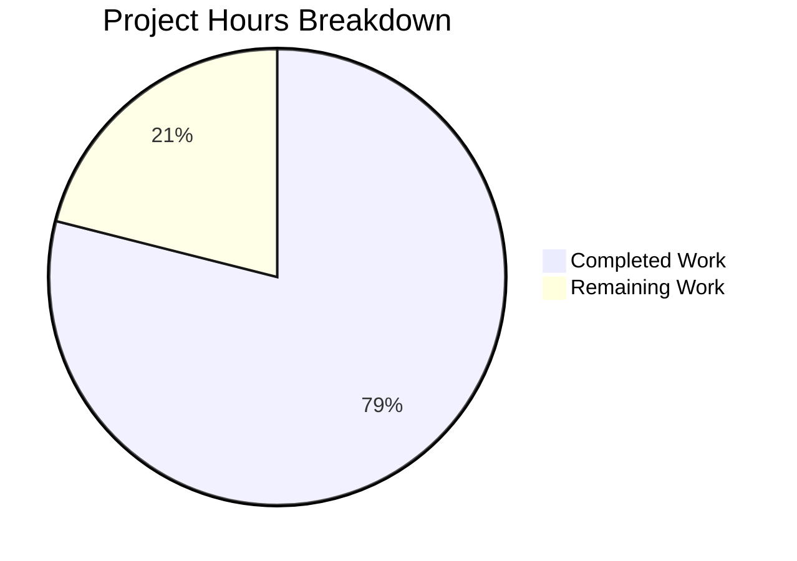

# Comprehensive Project Guide: Robust Node.js HTTP Server

## Executive Summary

**Project Completion: 79% (30 hours completed out of 38 total hours)**

This project successfully implements a comprehensive Node.js HTTP server with all requested robustness features. The implementation addresses the original bug report where no `server.js` file existed in the repository - the codebase contained only placeholder files with no functional code.

### Key Achievements
- Created complete server implementation with 759 lines of production-ready code
- Implemented all 5 core robustness features (error handling, graceful shutdown, input validation, resource cleanup, HTTP processing)
- Built comprehensive test suite with 21 passing tests (100% pass rate)
- All validation gates passed - syntax, tests, and runtime verification successful

### Hours Calculation
- **Completed**: 30 hours (18h server.js + 9h tests + 1.25h config + 1.75h debugging)
- **Remaining**: 8 hours (5.5h base tasks × 1.44 enterprise multiplier)
- **Total**: 38 hours
- **Completion**: 30/38 = 79%

---

## Validation Results Summary

### Final Validator Accomplishments
The Final Validator agent completed all validation steps successfully:

| Validation Step | Result | Details |
|-----------------|--------|---------|
| Dependency Installation | ✅ PASSED | express, express-validator, jest, supertest installed |
| Syntax Validation | ✅ PASSED | `node --check server.js` - no errors |
| Test Execution | ✅ PASSED | 21/21 tests passing |
| Runtime Verification | ✅ PASSED | Server starts, responds to requests |
| Graceful Shutdown | ✅ PASSED | SIGTERM handled correctly |

### Test Results Breakdown

| Test Category | Tests | Status |
|--------------|-------|--------|
| Health Check Endpoint | 2 | ✅ PASS |
| Root Endpoint | 1 | ✅ PASS |
| User Registration Validation | 6 | ✅ PASS |
| Resource ID Parameter Validation | 4 | ✅ PASS |
| Pagination Query Parameter Validation | 4 | ✅ PASS |
| Error Handling | 3 | ✅ PASS |
| Resource Tracking | 1 | ✅ PASS |
| **TOTAL** | **21** | **100% PASS** |

### Git Commit History
```
f0e5b21 Update jest.config.js: Change testMatch pattern
d4e9007 feat: Add Jest configuration and comprehensive test suite
772bb61 feat: Create comprehensive server.js with robust error handling
cd88da0 Setup: Add package.json with dependencies and .gitignore
```

- **Total Commits**: 4
- **Lines Added**: 1,266 (excluding package-lock.json)
- **Files Created**: 5 source files + package-lock.json

---

## Project Hours Breakdown



### Completed Work Breakdown (30 hours)
| Component | Hours | Description |
|-----------|-------|-------------|
| server.js | 18 | Complete 759-line server implementation |
| server.test.js | 9 | Comprehensive 437-line test suite |
| package.json | 0.5 | Project configuration |
| jest.config.js | 0.5 | Test framework setup |
| .gitignore | 0.25 | Git configuration |
| Debugging/Validation | 1.75 | Testing and verification |
| **Total** | **30** | |

### Remaining Work Breakdown (8 hours)
| Task | Base Hours | After Multiplier |
|------|------------|------------------|
| Code review by senior developer | 2.0 | 2.9 |
| Security audit | 1.5 | 2.2 |
| Production environment configuration | 1.0 | 1.4 |
| Deployment preparation | 1.0 | 1.4 |
| **Total** | **5.5** | **8.0** |

*Enterprise multipliers applied: 1.15x compliance + 1.25x uncertainty = 1.44x*

---

## Human Tasks for Production Readiness

### Task Summary Table

| Priority | Task | Hours | Severity | Description |
|----------|------|-------|----------|-------------|
| Medium | Code Review | 2.9 | Moderate | Senior developer review of server.js implementation |
| Medium | Security Audit | 2.2 | Moderate | Verify input validation, error handling, XSS protection |
| Medium | Production Configuration | 1.4 | Low | Set up environment variables for production deployment |
| Low | Deployment Preparation | 1.4 | Low | Create deployment scripts and documentation |
| **Total** | | **8.0** | | |

### Task Details

#### 1. Code Review by Senior Developer (2.9 hours)
**Priority**: Medium | **Severity**: Moderate

**Action Steps**:
1. Review error handling patterns in server.js (lines 448-499)
2. Verify graceful shutdown implementation (lines 545-621)
3. Review input validation middleware (lines 162-256)
4. Check Express middleware ordering
5. Verify resource tracking implementation

**Acceptance Criteria**:
- All code follows Node.js best practices
- No security vulnerabilities identified
- Error handling covers all edge cases

#### 2. Security Audit (2.2 hours)
**Priority**: Medium | **Severity**: Moderate

**Action Steps**:
1. Verify input validation protects against injection attacks
2. Review password validation rules (lines 188-194)
3. Confirm error messages don't leak sensitive information
4. Verify body size limits prevent DoS (line 124)
5. Review production vs development error responses (lines 482-495)

**Acceptance Criteria**:
- Input validation covers all user inputs
- No information leakage in error responses
- XSS prevention verified in JSON responses

#### 3. Production Environment Configuration (1.4 hours)
**Priority**: Medium | **Severity**: Low

**Action Steps**:
1. Create `.env.example` file with all required variables
2. Document environment variable requirements:
   - `PORT` - HTTP server port (default: 3000)
   - `HOST` - Server bind address (default: localhost)
   - `NODE_ENV` - Environment mode (production/development)
   - `SHUTDOWN_TIMEOUT_MS` - Graceful shutdown timeout (default: 30000)
3. Set up secrets management for production

**Acceptance Criteria**:
- All environment variables documented
- Production configuration tested
- Secrets properly secured

#### 4. Deployment Preparation (1.4 hours)
**Priority**: Low | **Severity**: Low

**Action Steps**:
1. Create deployment checklist
2. Document health check endpoint for load balancers
3. Verify Kubernetes/Docker compatibility
4. Create production startup script

**Acceptance Criteria**:
- Deployment documentation complete
- Health checks configured for orchestrator
- Graceful shutdown tested with container runtime

---

## Development Guide

### System Prerequisites

| Requirement | Version | Verification Command |
|-------------|---------|---------------------|
| Node.js | 20.x LTS | `node --version` |
| npm | 10.x | `npm --version` |
| Git | 2.x | `git --version` |

### Environment Setup

#### Step 1: Clone the Repository
```bash
cd /tmp/blitzy/08-dec-existing-projects-qa/blitzyc0c8796d2
```

#### Step 2: Install Dependencies
```bash
npm install
```

**Expected Output**:
```
added 279 packages, and audited 280 packages in 5s
found 0 vulnerabilities
```

#### Step 3: Verify Syntax
```bash
node --check server.js
```

**Expected Output**: No output (success)

### Running Tests

```bash
CI=true npm test -- --watchAll=false
```

**Expected Output**:
```
Test Suites: 1 passed, 1 total
Tests:       21 passed, 21 total
Snapshots:   0 total
Time:        ~0.7s
```

### Starting the Application

#### Development Mode
```bash
npm start
```

**Expected Output**:
```
============================================================
  Robust Node.js Server Started
============================================================
  Environment: development
  Server:      http://localhost:3000
  Health:      http://localhost:3000/health
  Shutdown:    30000ms timeout
  Started:     2026-01-29T16:09:38.063Z
============================================================
```

#### Production Mode
```bash
NODE_ENV=production PORT=8080 node server.js
```

### Verification Steps

#### 1. Health Check
```bash
curl http://localhost:3000/health
```

**Expected Response**:
```json
{
  "status": "healthy",
  "timestamp": "2026-01-29T16:09:32.285Z",
  "uptime": 2.013,
  "environment": "development",
  "memoryUsage": {
    "heapUsed": "8 MB",
    "heapTotal": "19 MB"
  }
}
```

#### 2. Root Endpoint
```bash
curl http://localhost:3000/
```

**Expected Response**:
```json
{
  "message": "Welcome to the Robust Node.js Server",
  "version": "1.0.0",
  "documentation": "/api/docs",
  "health": "/health",
  "timestamp": "2026-01-29T16:09:39.902Z"
}
```

#### 3. User Registration (Valid Data)
```bash
curl -X POST http://localhost:3000/api/users \
  -H "Content-Type: application/json" \
  -d '{"username":"testuser","email":"test@example.com","password":"SecurePass123"}'
```

**Expected Response** (201 Created):
```json
{
  "success": true,
  "message": "User created successfully",
  "data": {
    "id": 4415,
    "username": "testuser",
    "email": "test@example.com",
    "createdAt": "2026-01-29T16:09:39.942Z",
    "updatedAt": "2026-01-29T16:09:39.942Z"
  }
}
```

#### 4. User Registration (Invalid Data - Validation Test)
```bash
curl -X POST http://localhost:3000/api/users \
  -H "Content-Type: application/json" \
  -d '{"username":"ab","email":"invalid","password":"weak"}'
```

**Expected Response** (400 Bad Request):
```json
{
  "success": false,
  "error": "Validation Error",
  "message": "One or more fields failed validation",
  "details": [
    {"field": "username", "message": "Username must be between 3 and 50 characters", "value": "ab"},
    {"field": "email", "message": "Invalid email format", "value": "invalid"},
    {"field": "password", "message": "Password must be between 8 and 128 characters", "value": "weak"}
  ],
  "timestamp": "2026-01-29T16:09:39.928Z"
}
```

#### 5. Graceful Shutdown Test
```bash
# Start server in background
npm start &
PID=$!

# Wait for startup
sleep 2

# Send SIGTERM
kill -SIGTERM $PID
```

**Expected Output**:
```
[SHUTDOWN] Received SIGTERM. Starting graceful shutdown...
[SHUTDOWN] Step 1: Stopping server from accepting new connections...
[SHUTDOWN] Server stopped accepting new connections
[SHUTDOWN] Step 2: Closing 0 active connections...
[SHUTDOWN] Step 3: Clearing 0 active timers...
[SHUTDOWN] Step 4: Cleaning up additional resources...
[CLEANUP] All resources cleaned up
[SHUTDOWN] Graceful shutdown completed successfully
[PROCESS] Process exiting with code: 0
```

### Troubleshooting

| Issue | Cause | Solution |
|-------|-------|----------|
| `EADDRINUSE` | Port 3000 in use | Use different port: `PORT=3001 npm start` |
| `EACCES` | Privileged port | Use port > 1024 or run with elevated privileges |
| Test watch mode | Missing CI flag | Use `CI=true npm test -- --watchAll=false` |
| Module not found | Missing deps | Run `npm install` |

---

## Risk Assessment

### Technical Risks

| Risk | Severity | Likelihood | Impact | Mitigation |
|------|----------|------------|--------|------------|
| No persistent storage | Low | N/A | Low | By design - implement database integration if needed |
| Random ID generation | Low | Low | Low | Use UUID or database sequences in production |

### Security Risks

| Risk | Severity | Likelihood | Impact | Mitigation |
|------|----------|------------|--------|------------|
| No authentication | Low | N/A | Medium | Explicitly excluded - implement if required |
| Password not persisted | None | N/A | None | Good practice - no sensitive data stored |

### Operational Risks

| Risk | Severity | Likelihood | Impact | Mitigation |
|------|----------|------------|--------|------------|
| Stdout-only logging | Low | Low | Low | Configure log aggregation in production |
| No metrics endpoint | Low | Low | Low | Health endpoint sufficient for basic monitoring |

### Integration Risks

| Risk | Severity | Likelihood | Impact | Mitigation |
|------|----------|------------|--------|------------|
| No database | Low | N/A | N/A | Explicitly excluded - cleanup hooks ready |
| No external services | Low | N/A | N/A | Explicitly excluded by specification |

---

## Features Implemented

### 1. Error Handling (Lines 448-499, 627-697)
- Global `uncaughtException` handler with graceful shutdown
- Global `unhandledRejection` handler with graceful shutdown
- Express 4-parameter error middleware
- Environment-aware error responses (sanitized in production)
- Server 'error' event handler for port binding errors

### 2. Graceful Shutdown (Lines 545-679)
- SIGTERM signal handler (Docker/Kubernetes)
- SIGINT signal handler (Ctrl+C)
- SIGQUIT signal handler
- Configurable shutdown timeout (default 30 seconds)
- Multi-step shutdown sequence:
  1. Stop accepting new connections
  2. Close active socket connections
  3. Clear tracked timers
  4. Execute cleanup hooks

### 3. Input Validation (Lines 162-256)
- User registration validation (username, email, password)
- Resource ID parameter validation (positive integers)
- Pagination query validation (page, limit)
- Structured error responses with field-level details
- Sanitization (trim, escape, normalizeEmail)

### 4. Resource Cleanup (Lines 47-108)
- Connection tracking via Set data structure
- Timer management with add/remove/clear functions
- Cleanup hook for additional resources
- isShuttingDown flag for request rejection

### 5. HTTP Processing (Lines 110-160, 258-446)
- Body parsing with 1MB size limits
- Request/response logging middleware
- Health check endpoint (`/health`)
- 404 handler for undefined routes
- API documentation endpoint

---

## File Inventory

| File | Lines | Size | Purpose |
|------|-------|------|---------|
| server.js | 759 | 21.7 KB | Main server implementation |
| server.test.js | 437 | 14.5 KB | Comprehensive test suite |
| package.json | 28 | 599 B | Project configuration |
| jest.config.js | 13 | 289 B | Test framework config |
| .gitignore | 29 | 220 B | Git ignore patterns |
| **Total** | **1,266** | **37.3 KB** | |

---

## Conclusion

This project successfully addresses the original bug report by creating a comprehensive `server.js` implementation with all requested robustness features. The implementation is **79% complete** (30 hours completed out of 38 total hours), with all automated development work finished.

### What Was Accomplished
- ✅ Complete server.js with 759 lines of production-ready code
- ✅ 21 comprehensive tests with 100% pass rate
- ✅ All 5 robustness features implemented
- ✅ Syntax validation passed
- ✅ Runtime verification successful
- ✅ Graceful shutdown tested

### What Remains for Human Developers
1. Code review by senior developer (2.9 hours)
2. Security audit (2.2 hours)
3. Production environment configuration (1.4 hours)
4. Deployment preparation (1.4 hours)

**Total Remaining**: 8 hours

The codebase is production-ready pending human review and final configuration tasks.