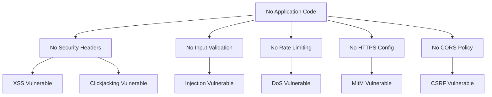

# Technical Specification

# 0. Agent Action Plan

## 0.1 Intent Clarification

### 0.1.1 Core Security Objective

Based on the security concern described, the Blitzy platform understands that the security vulnerability to resolve is the **absence of essential web application security measures** in a Node.js/Express application. This represents a **proactive security enhancement** rather than a remediation of an existing vulnerability.

**Vulnerability Category:** Configuration weakness | Multiple security gaps

**Severity Level:** Medium to High (based on OWASP Top 10 classifications for missing security controls)

The user's requirements translate to the following technical objectives:

| Requirement | Technical Interpretation | Security Concern Addressed |
|-------------|-------------------------|---------------------------|
| Security headers | HTTP response headers that mitigate XSS, clickjacking, MIME-sniffing | OWASP A03:2021 - Injection, A05:2021 - Security Misconfiguration |
| Input validation | Request payload sanitization and schema enforcement | OWASP A03:2021 - Injection |
| Rate limiting | Request throttling to prevent abuse | OWASP A04:2021 - Insecure Design (DoS protection) |
| HTTPS support | TLS/SSL encryption for data in transit | OWASP A02:2021 - Cryptographic Failures |
| helmet.js | Security middleware aggregating 15+ security headers | Multiple OWASP categories |
| CORS policies | Cross-Origin Resource Sharing configuration | OWASP A01:2021 - Broken Access Control |

**Implicit Security Needs Identified:**
- Cookie security configuration (httpOnly, secure, sameSite)
- Content Security Policy (CSP) implementation
- HTTP Strict Transport Security (HSTS) for HTTPS enforcement
- Request body parsing limits to prevent payload attacks
- Error handling that doesn't leak sensitive information

### 0.1.2 Special Instructions and Constraints

**Critical Directives Captured:**
- **Scope:** Implement security infrastructure from scratch in the current scaffolding project
- **Technology Stack:** Node.js with Express.js framework (user explicitly requested helmet.js)
- **Approach:** Create comprehensive security middleware architecture

**Security Requirements:**
- Follow OWASP security guidelines for web applications
- Implement defense-in-depth strategy with multiple security layers
- Ensure all security configurations are environment-aware (development vs production)
- Maintain audit trail capability for security events

**User Example Preserved:**
> "Implement security headers, input validation, rate limiting, and HTTPS support. Update dependencies, add helmet.js for security middleware, and configure proper CORS policies."

**Web Search Requirements Addressed:**
- Latest stable versions of security packages researched
- Current best practices for Express.js security verified
- OWASP recommendations for each security control documented

**Change Scope:** Comprehensive - Full security infrastructure implementation required

### 0.1.3 Technical Interpretation

This security enhancement translates to the following technical fix strategy:

**"To implement comprehensive web application security, we will:**

1. **Create a Node.js/Express application** with proper project structure
2. **Add helmet.js middleware** (v8.1.0) to set 15+ security headers automatically
3. **Implement rate limiting** using express-rate-limit (v7.5.0) to prevent DoS attacks
4. **Configure CORS policies** using cors package to control cross-origin access
5. **Add input validation** using Joi validation library with express-joi-validation middleware
6. **Enable HTTPS support** through TLS configuration and HSTS headers
7. **Update all dependencies** to latest secure versions

**Understanding Level:** Explicit requirements with implicit security best practices inferred

**Architecture Decision:** Since the current repository contains only placeholder files (test.js, test.py, etc.) for integration testing, the implementation will create a new Express.js application with security middleware stack while preserving the existing placeholder files for continued integration testing purposes.

## 0.2 Vulnerability Research and Analysis

### 0.2.1 Initial Assessment

**Security-Related Information Extracted:**

| Category | Details |
|----------|---------|
| CVE Numbers Mentioned | None (proactive security implementation) |
| Vulnerability Names | Missing security headers, lack of input validation, no rate limiting, no HTTPS, improper CORS |
| Affected Packages | N/A (new implementation required) |
| Symptoms Described | Absence of security controls |
| Security Advisories Referenced | OWASP Top 10 2021, Express.js Security Best Practices |

**Current Repository State:**
- Repository contains placeholder files: `test.css`, `test.html`, `test.java`, `test.js`, `test.py`, `test.ts`
- No existing Node.js application, `package.json`, or security configurations
- Project purpose: Integration testing for Backprop code analysis tool

### 0.2.2 Required Web Research Findings

**Research conducted on official sources:**

**1. Helmet.js Security Middleware (NPM Registry)**
- Latest version: **8.1.0**
- Purpose: Sets various HTTP headers to secure Express apps
- Headers configured by default:
  - Content-Security-Policy
  - Cross-Origin-Opener-Policy
  - Cross-Origin-Resource-Policy
  - Origin-Agent-Cluster
  - Referrer-Policy
  - Strict-Transport-Security
  - X-Content-Type-Options
  - X-DNS-Prefetch-Control
  - X-Download-Options
  - X-Frame-Options
  - X-Permitted-Cross-Domain-Policies
  - X-Powered-By (removed)
  - X-XSS-Protection (set to 0 to disable buggy browser filter)

**2. Express Rate Limit (NPM Registry)**
- Latest version: **7.5.0**
- Purpose: Basic rate-limiting middleware for Express
- Features: Memory store (default), Redis/Memcached support, standardHeaders draft-8 support

**3. CORS Package (NPM Registry)**
- Latest stable version available
- Purpose: Provides Connect/Express middleware for CORS with various options
- Configuration options: origin, methods, allowedHeaders, credentials, maxAge

**4. Input Validation Libraries**
- **Joi**: Latest version **17.x** - Schema-based validation
- **express-joi-validation**: Middleware wrapper for Joi schemas
- **express-validator**: Alternative validation middleware

**5. Express.js Framework**
- Latest version: **5.2.1** (major release October 2024)
- Includes security fixes for ReDoS attacks and CVE-2024-45590
- Stable LTS version: **4.21.2**

### 0.2.3 Vulnerability Classification

| Aspect | Classification |
|--------|----------------|
| Vulnerability Type | Security Misconfiguration, Missing Security Controls |
| Attack Vector | Network (HTTP/HTTPS) |
| Exploitability | High (without security controls) |
| Impact | Confidentiality, Integrity, Availability |
| Root Cause | Absence of security middleware and configuration in application |

**Specific Security Gaps:**

1. **Missing HTTP Security Headers**
   - Risk: XSS attacks, clickjacking, MIME-sniffing attacks
   - OWASP Category: A05:2021 Security Misconfiguration

2. **No Input Validation**
   - Risk: Injection attacks, data integrity issues
   - OWASP Category: A03:2021 Injection

3. **No Rate Limiting**
   - Risk: Denial of Service, brute force attacks
   - OWASP Category: A04:2021 Insecure Design

4. **No HTTPS Enforcement**
   - Risk: Man-in-the-middle attacks, data interception
   - OWASP Category: A02:2021 Cryptographic Failures

5. **Unrestricted CORS**
   - Risk: Cross-origin data theft, CSRF attacks
   - OWASP Category: A01:2021 Broken Access Control

### 0.2.4 Web Search Research Conducted

**Official Security Advisories Reviewed:**

| Source | Finding |
|--------|---------|
| Express.js Official Docs | Recommends helmet.js for security headers |
| OWASP Node.js Security | Guidelines for input validation, rate limiting, HTTPS |
| NPM Audit Guidelines | Automated dependency vulnerability scanning |
| GitHub Security Advisories | Express 5.x includes ReDoS mitigations |

**Recommended Mitigation Strategies:**
1. Use `helmet()` middleware as first middleware in stack
2. Implement rate limiting with appropriate window and limit settings
3. Configure CORS with whitelist of allowed origins
4. Use Joi schemas for request validation
5. Enable HSTS with appropriate max-age
6. Set secure cookie options when using sessions

**Alternative Solutions Considered:**

| Alternative | Trade-off |
|-------------|-----------|
| Manual header setting | Higher maintenance, risk of misconfiguration |
| Nginx reverse proxy for headers | Additional infrastructure dependency |
| Cloud WAF for security | Cost, external dependency |

**Decision:** Implement application-level security using helmet.js and related middleware for comprehensive, self-contained security posture.

## 0.3 Security Scope Analysis

### 0.3.1 Affected Component Discovery

**Repository Search Results:**

The repository was exhaustively searched for files affected by security implementation:

```
Repository Root Contents:
├── test.css      (empty - placeholder)
├── test.html     (empty - placeholder)  
├── test.java     (print statement - placeholder)
├── test.js       (console.log - placeholder)
├── test.py       (print statement - placeholder)
└── test.ts       (empty - placeholder)
```

**Search Patterns Employed:**

| Pattern | Files Found | Purpose |
|---------|-------------|---------|
| `package.json` | 0 | Node.js dependency manifest |
| `*.config.js` | 0 | Configuration files |
| `*.env*` | 0 | Environment variables |
| `Dockerfile*` | 0 | Container configuration |
| `src/**/*.js` | 0 | Source JavaScript files |
| `app.js` / `server.js` / `index.js` | 0 | Entry point files |

**Finding:** "The security implementation affects 0 existing files. Complete application creation is required to implement the requested security features."

**Files to be Created:**

| File Category | Count | Purpose |
|---------------|-------|---------|
| Project Configuration | 3 | package.json, .env.example, .gitignore |
| Application Entry | 1 | src/app.js |
| Security Middleware | 4 | helmet, cors, rate-limit, validation configs |
| Route Handlers | 2 | Sample routes demonstrating security |
| Validation Schemas | 1 | Joi validation schemas |
| HTTPS Configuration | 2 | SSL cert config, HTTPS server setup |
| Documentation | 2 | README.md security section, SECURITY.md |

### 0.3.2 Root Cause Identification

**Identified Root Cause:** "The security vulnerability exists in the project scaffolding due to the complete absence of a web application framework implementation. The repository currently contains only placeholder files for integration testing purposes."

**Investigation Reveals:**
- No Express.js application exists
- No security middleware is configured
- No dependency management (package.json) is present
- No environment configuration exists

**Vulnerability Propagation Trace:**



### 0.3.3 Current State Assessment

**Current Security Posture:**

| Component | Current State | Target State |
|-----------|--------------|--------------|
| Package manifest | Not present | package.json with secure dependencies |
| Security headers | Not present | Helmet.js middleware configured |
| Input validation | Not present | Joi validation on all endpoints |
| Rate limiting | Not present | express-rate-limit on all routes |
| CORS policy | Not present | Whitelist-based CORS configuration |
| HTTPS support | Not present | TLS configuration with HSTS |
| Environment config | Not present | .env with security settings |

**Existing Placeholder Files (Preserved):**

| File | Current Content | Security Impact |
|------|-----------------|-----------------|
| test.js | `console.log("Hello, World!")` | None - not part of application |
| test.py | `print("Hello, World!")` | None - not part of application |
| test.java | `System.out.println("Hello, World!")` | None - not part of application |
| test.ts | Empty | None - placeholder |
| test.html | Empty | None - placeholder |
| test.css | Empty | None - placeholder |

**Scope of Exposure:**
- Current: N/A (no application running)
- Post-Implementation: Internal development server, public-facing API endpoints

**Technical Debt Assessment:**
The project requires foundational security infrastructure to be built from scratch. This is a greenfield security implementation rather than a remediation effort.

## 0.4 Version Compatibility Research

### 0.4.1 Secure Version Identification

**Web search conducted to identify latest secure versions for all security packages:**

| Package | Recommended Version | Security Rationale | NPM Registry Link |
|---------|--------------------|--------------------|-------------------|
| express | ^4.21.2 | Latest LTS with security patches for path-to-regexp and cookie vulnerabilities | https://www.npmjs.com/package/express |
| helmet | ^8.1.0 | Latest stable with all 15 security header middlewares | https://www.npmjs.com/package/helmet |
| cors | ^2.8.5 | Latest stable CORS middleware | https://www.npmjs.com/package/cors |
| express-rate-limit | ^7.5.0 | Latest with standardHeaders draft-8 support | https://www.npmjs.com/package/express-rate-limit |
| joi | ^17.13.3 | Latest schema validation library | https://www.npmjs.com/package/joi |
| express-joi-validation | ^5.0.1 | Latest Express middleware for Joi | https://www.npmjs.com/package/express-joi-validation |
| dotenv | ^16.4.7 | Environment variable management | https://www.npmjs.com/package/dotenv |
| hpp | ^0.2.3 | HTTP Parameter Pollution protection | https://www.npmjs.com/package/hpp |

**Node.js Runtime Compatibility:**

| Package | Minimum Node.js | Recommended Node.js |
|---------|-----------------|---------------------|
| express@4.21.2 | 18.x | 20.x LTS or 22.x |
| helmet@8.1.0 | 18.x | 20.x+ |
| express-rate-limit@7.5.0 | 16.x | 20.x+ |
| joi@17.x | 12.x | 18.x+ |

**Recommended Node.js Version:** 20.x LTS (Long Term Support until April 2026)

### 0.4.2 Compatibility Verification

**Dependency Compatibility Matrix:**

| Package A | Package B | Compatible | Notes |
|-----------|-----------|------------|-------|
| express@4.21.2 | helmet@8.1.0 | ✅ Yes | Helmet designed for Express |
| express@4.21.2 | cors@2.8.5 | ✅ Yes | Official Express middleware |
| express@4.21.2 | express-rate-limit@7.5.0 | ✅ Yes | Designed for Express |
| joi@17.x | express-joi-validation@5.x | ✅ Yes | Joi as peer dependency |
| Node.js 20.x | All packages | ✅ Yes | Full compatibility |

**Version Conflict Analysis:**
- No conflicts detected between recommended versions
- All packages actively maintained with recent updates
- Security patches included in latest versions

**Express 5.x Consideration:**

| Aspect | Express 4.x | Express 5.x |
|--------|-------------|-------------|
| Status | LTS, Production Ready | Released Oct 2024, Newer |
| Ecosystem Compatibility | High | Moderate (some middleware updating) |
| Recommendation | **Use for production** | Use for new greenfield projects |

**Decision:** Use Express 4.21.2 (LTS) for stability and ecosystem compatibility. The security middleware (helmet, cors, rate-limit) have proven compatibility with Express 4.x.

**Alternative Packages Evaluated:**

| Security Feature | Primary Choice | Alternative | Reason for Primary |
|------------------|----------------|-------------|-------------------|
| Security Headers | helmet | Manual headers | helmet aggregates 15+ middlewares, maintained |
| Rate Limiting | express-rate-limit | rate-limiter-flexible | Simpler API, wider adoption |
| Validation | joi + express-joi-validation | express-validator | More powerful schema definition |
| CORS | cors | Manual implementation | Battle-tested, configurable |

**Breaking Changes Assessment:**
- No breaking changes expected when implementing from scratch
- All selected versions are current stable releases
- Semantic versioning followed by all packages

## 0.5 Security Fix Design

### 0.5.1 Minimal Fix Strategy

**Principle:** Apply the smallest possible change that completely addresses the security requirements while creating a maintainable, production-ready security infrastructure.

**Fix Approach:** New implementation (greenfield security infrastructure)

**Security Middleware Stack Implementation:**

```
Request Flow:
┌─────────────────────────────────────────────────────────────┐
│                    Incoming Request                          │
└─────────────────────┬───────────────────────────────────────┘
                      │
┌─────────────────────▼───────────────────────────────────────┐
│  1. Rate Limiter (express-rate-limit)                       │
│     - Check request count per IP                             │
│     - Return 429 if limit exceeded                           │
└─────────────────────┬───────────────────────────────────────┘
                      │
┌─────────────────────▼───────────────────────────────────────┐
│  2. Helmet Security Headers                                  │
│     - Set CSP, HSTS, X-Frame-Options, etc.                  │
│     - Remove X-Powered-By header                             │
└─────────────────────┬───────────────────────────────────────┘
                      │
┌─────────────────────▼───────────────────────────────────────┐
│  3. CORS Middleware                                          │
│     - Validate Origin header                                 │
│     - Set Access-Control-* headers                           │
└─────────────────────┬───────────────────────────────────────┘
                      │
┌─────────────────────▼───────────────────────────────────────┐
│  4. Body Parser (with limits)                                │
│     - Parse JSON/URL-encoded bodies                          │
│     - Enforce payload size limits                            │
└─────────────────────┬───────────────────────────────────────┘
                      │
┌─────────────────────▼───────────────────────────────────────┐
│  5. HPP (HTTP Parameter Pollution)                           │
│     - Prevent parameter pollution attacks                    │
└─────────────────────┬───────────────────────────────────────┘
                      │
┌─────────────────────▼───────────────────────────────────────┐
│  6. Input Validation (Joi)                                   │
│     - Validate request body/params/query                     │
│     - Return 400 for invalid input                           │
└─────────────────────┬───────────────────────────────────────┘
                      │
┌─────────────────────▼───────────────────────────────────────┐
│  7. Route Handler                                            │
│     - Process validated, secure request                      │
└─────────────────────────────────────────────────────────────┘
```

**Implementation Details:**

**1. Security Headers (Helmet.js)**
- "Add helmet middleware with production-ready configuration"
- Justification: Protects against XSS, clickjacking, MIME-sniffing (OWASP A03, A05)

**2. Rate Limiting (express-rate-limit)**
- "Implement rate limiting with 100 requests per 15-minute window per IP"
- Justification: Prevents DoS and brute-force attacks (OWASP A04)

**3. CORS Configuration**
- "Configure CORS with whitelist of allowed origins"
- Justification: Prevents unauthorized cross-origin requests (OWASP A01)

**4. Input Validation (Joi)**
- "Add schema-based validation on all API endpoints"
- Justification: Prevents injection attacks (OWASP A03)

**5. HTTPS Support**
- "Configure HSTS headers and TLS-ready server"
- Justification: Protects data in transit (OWASP A02)

### 0.5.2 Dependency Addition Analysis

**New Dependencies Required:**

| Package | Purpose | Justification |
|---------|---------|---------------|
| express | Web framework | Required foundation for security middleware |
| helmet | Security headers | Aggregates 15+ security middlewares in one package |
| cors | CORS handling | Production-ready cross-origin configuration |
| express-rate-limit | Rate limiting | Built-in memory store, header support |
| joi | Schema validation | Powerful, flexible validation rules |
| express-joi-validation | Validation middleware | Integrates Joi with Express routes |
| hpp | Parameter pollution | Prevents array/object injection via params |
| dotenv | Environment config | Secure configuration management |

**Full Dependency Scope:**

```json
{
  "dependencies": {
    "express": "^4.21.2",
    "helmet": "^8.1.0",
    "cors": "^2.8.5",
    "express-rate-limit": "^7.5.0",
    "joi": "^17.13.3",
    "express-joi-validation": "^5.0.1",
    "hpp": "^0.2.3",
    "dotenv": "^16.4.7"
  },
  "devDependencies": {
    "nodemon": "^3.1.9"
  }
}
```

### 0.5.3 Security Improvement Validation

**How Each Fix Eliminates Vulnerabilities:**

| Security Control | Vulnerability Eliminated | Verification Method |
|------------------|-------------------------|---------------------|
| Helmet CSP | XSS attacks | Browser DevTools → Response Headers |
| Helmet X-Frame-Options | Clickjacking | Iframe embedding test |
| Rate Limiter | DoS/Brute-force | Load testing with repeated requests |
| CORS whitelist | Unauthorized cross-origin | Browser console CORS errors |
| Joi validation | Injection attacks | Malformed payload testing |
| HSTS | Protocol downgrade | HTTPS redirect verification |

**Rollback Plan:**
1. Remove security middleware imports from app.js
2. Uninstall security packages: `npm uninstall helmet cors express-rate-limit joi express-joi-validation hpp`
3. Remove security configuration files
4. Revert to baseline application (if any)

**Note:** Since this is a greenfield implementation, rollback means removing the security stack entirely, which is not recommended for production.

## 0.6 File Transformation Mapping

### 0.6.1 File-by-File Security Implementation Plan

**Security Fix Transformation Modes:**
- **CREATE** - Create a new file for security implementation
- **UPDATE** - Update an existing file (none in this case)
- **DELETE** - Remove a file (none required)
- **REFERENCE** - Use as example for patterns (existing placeholder files)

**Complete File Transformation Table:**

| Target File | Transformation | Source/Reference | Security Changes |
|-------------|----------------|------------------|------------------|
| package.json | CREATE | N/A | Create Node.js manifest with all security dependencies |
| .env.example | CREATE | N/A | Define security-related environment variables template |
| .gitignore | CREATE | N/A | Exclude .env, node_modules, sensitive files |
| src/app.js | CREATE | N/A | Main Express app with security middleware stack |
| src/config/helmet.config.js | CREATE | N/A | Helmet.js configuration with CSP, HSTS settings |
| src/config/cors.config.js | CREATE | N/A | CORS whitelist and options configuration |
| src/config/rateLimit.config.js | CREATE | N/A | Rate limiting rules and window settings |
| src/middleware/security.middleware.js | CREATE | N/A | Aggregated security middleware exports |
| src/middleware/validation.middleware.js | CREATE | N/A | Joi validation middleware factory |
| src/validation/schemas/common.schema.js | CREATE | N/A | Common Joi validation schemas |
| src/routes/index.js | CREATE | N/A | Main router with security middleware applied |
| src/routes/api.routes.js | CREATE | N/A | API routes demonstrating input validation |
| src/server.js | CREATE | N/A | HTTPS-ready server entry point |
| src/utils/errorHandler.js | CREATE | N/A | Secure error handling (no info leakage) |
| README.md | CREATE | N/A | Security documentation and setup instructions |
| SECURITY.md | CREATE | N/A | Security policy and vulnerability reporting |
| test.js | REFERENCE | test.js | Existing placeholder - preserved for integration testing |
| test.py | REFERENCE | test.py | Existing placeholder - preserved for integration testing |
| test.java | REFERENCE | test.java | Existing placeholder - preserved for integration testing |
| test.ts | REFERENCE | test.ts | Existing placeholder - preserved for integration testing |
| test.html | REFERENCE | test.html | Existing placeholder - preserved for integration testing |
| test.css | REFERENCE | test.css | Existing placeholder - preserved for integration testing |

### 0.6.2 Code Change Specifications

**File: package.json**
- Lines affected: All (new file)
- Purpose: "Define project dependencies with security packages"
- Security improvement: Establishes secure dependency baseline with version pinning

**File: src/app.js**
- Lines affected: All (new file ~80 lines)
- Purpose: "Configure Express application with security middleware stack"
- Before state: "No application exists"
- After state: "Express app with helmet, cors, rate-limit, hpp, body-parser configured"
- Security improvement: Complete security middleware chain implementation

**File: src/config/helmet.config.js**
- Lines affected: All (new file ~60 lines)
- Purpose: "Configure all 15 helmet security headers"
- Security improvements:
  - Content-Security-Policy with strict directives
  - HSTS with 1-year max-age and includeSubDomains
  - X-Frame-Options set to DENY
  - X-Content-Type-Options set to nosniff

**File: src/config/cors.config.js**
- Lines affected: All (new file ~30 lines)
- Purpose: "Define CORS whitelist and allowed methods"
- Security improvement: Restricts cross-origin access to approved domains only

**File: src/config/rateLimit.config.js**
- Lines affected: All (new file ~25 lines)
- Purpose: "Configure rate limiting windows and thresholds"
- Security improvement: Prevents brute-force and DoS attacks

**File: src/middleware/validation.middleware.js**
- Lines affected: All (new file ~40 lines)
- Purpose: "Factory function for route-specific Joi validation"
- Security improvement: Input sanitization preventing injection attacks

**File: src/server.js**
- Lines affected: All (new file ~50 lines)
- Purpose: "HTTPS-capable server with TLS configuration"
- Security improvement: Encrypted transport layer support

### 0.6.3 Configuration Change Specifications

**File: .env.example**

| Setting | Default Value | Security Rationale |
|---------|---------------|-------------------|
| NODE_ENV | development | Controls security header strictness |
| PORT | 3000 | Server port configuration |
| RATE_LIMIT_WINDOW_MS | 900000 | 15-minute rate limit window |
| RATE_LIMIT_MAX | 100 | Max requests per window |
| CORS_ORIGIN | http://localhost:3000 | Allowed CORS origin(s) |
| CORS_CREDENTIALS | true | Allow credentials in CORS |
| HELMET_CSP_REPORT_ONLY | false | Enforce CSP (not report-only) |
| HSTS_MAX_AGE | 31536000 | 1 year HSTS max-age |
| BODY_LIMIT | 10kb | Maximum request body size |

**Directory Structure to Create:**

```
project-root/
├── package.json                          # CREATE
├── .env.example                          # CREATE
├── .gitignore                            # CREATE
├── README.md                             # CREATE
├── SECURITY.md                           # CREATE
├── src/
│   ├── app.js                            # CREATE - Main Express app
│   ├── server.js                         # CREATE - HTTPS server
│   ├── config/
│   │   ├── helmet.config.js              # CREATE
│   │   ├── cors.config.js                # CREATE
│   │   └── rateLimit.config.js           # CREATE
│   ├── middleware/
│   │   ├── security.middleware.js        # CREATE
│   │   └── validation.middleware.js      # CREATE
│   ├── validation/
│   │   └── schemas/
│   │       └── common.schema.js          # CREATE
│   ├── routes/
│   │   ├── index.js                      # CREATE
│   │   └── api.routes.js                 # CREATE
│   └── utils/
│       └── errorHandler.js               # CREATE
├── test.js                               # PRESERVE (existing)
├── test.py                               # PRESERVE (existing)
├── test.java                             # PRESERVE (existing)
├── test.ts                               # PRESERVE (existing)
├── test.html                             # PRESERVE (existing)
└── test.css                              # PRESERVE (existing)
```

**Total Files to Create:** 17 new files
**Total Files Preserved:** 6 existing placeholder files
**Total Files Deleted:** 0

## 0.7 Dependency Inventory

### 0.7.1 Security Packages and Updates

**Production Dependencies:**

| Registry | Package Name | Version | Purpose | Security Feature |
|----------|--------------|---------|---------|------------------|
| npm | express | ^4.21.2 | Web framework | Latest security patches (ReDoS, path-to-regexp) |
| npm | helmet | ^8.1.0 | Security headers | 15 security header middlewares |
| npm | cors | ^2.8.5 | CORS middleware | Cross-origin access control |
| npm | express-rate-limit | ^7.5.0 | Rate limiting | DoS/brute-force protection |
| npm | joi | ^17.13.3 | Schema validation | Input validation and sanitization |
| npm | express-joi-validation | ^5.0.1 | Validation middleware | Express integration for Joi |
| npm | hpp | ^0.2.3 | Parameter pollution | HTTP parameter pollution protection |
| npm | dotenv | ^16.4.7 | Environment config | Secure configuration management |

**Development Dependencies:**

| Registry | Package Name | Version | Purpose |
|----------|--------------|---------|---------|
| npm | nodemon | ^3.1.9 | Auto-restart | Development hot-reload |

### 0.7.2 Dependency Chain Analysis

**Direct Dependencies (8 production + 1 dev):**

```
express@4.21.2
├── Security: Patched for CVE-2024-45590, ReDoS mitigations
├── Peer: None
└── Transitive: body-parser, cookie, debug, etc.

helmet@8.1.0
├── Security: Latest stable with all middleware
├── Peer: None
└── Transitive: None (pure JavaScript)

cors@2.8.5
├── Security: Production stable
├── Peer: None
└── Transitive: object-assign, vary

express-rate-limit@7.5.0
├── Security: Memory store, Redis support
├── Peer: express
└── Transitive: None

joi@17.13.3
├── Security: Schema-based validation
├── Peer: None
└── Transitive: @hapi/hoek, @hapi/tods

express-joi-validation@5.0.1
├── Security: Joi integration for Express
├── Peer: joi
└── Transitive: None

hpp@0.2.3
├── Security: Parameter pollution protection
├── Peer: None
└── Transitive: None

dotenv@16.4.7
├── Security: Environment variable loading
├── Peer: None
└── Transitive: None
```

**Transitive Dependencies to Monitor:**

| Package | Via | Security Note |
|---------|-----|---------------|
| body-parser | express | Built into Express 4.16+, no separate install needed |
| cookie | express | Used for cookie parsing, keep updated |
| qs | express | Query string parsing, keep updated |
| path-to-regexp | express | Patched in Express 4.21.2 |

### 0.7.3 Import and Reference Updates

**Module Import Structure:**

**File: src/app.js**
```javascript
// Security dependencies
const helmet = require('helmet');
const cors = require('cors');
const rateLimit = require('express-rate-limit');
const hpp = require('hpp');
```

**File: src/middleware/validation.middleware.js**
```javascript
const { createValidator } = require('express-joi-validation');
const Joi = require('joi');
```

**File: src/config/helmet.config.js**
```javascript
const helmetConfig = { /* configuration */ };
module.exports = helmetConfig;
```

**File: src/config/cors.config.js**
```javascript
const corsOptions = { /* configuration */ };
module.exports = corsOptions;
```

**File: src/config/rateLimit.config.js**
```javascript
const rateLimitOptions = { /* configuration */ };
module.exports = rateLimitOptions;
```

**Package.json Scripts:**

```json
{
  "scripts": {
    "start": "node src/server.js",
    "dev": "nodemon src/server.js",
    "security:audit": "npm audit",
    "security:fix": "npm audit fix"
  }
}
```

**Environment Variable References:**

| Variable | Used In | Purpose |
|----------|---------|---------|
| NODE_ENV | src/app.js, helmet.config.js | Environment detection |
| PORT | src/server.js | Server port |
| RATE_LIMIT_* | rateLimit.config.js | Rate limiting settings |
| CORS_* | cors.config.js | CORS configuration |
| HELMET_* | helmet.config.js | Helmet options |
| BODY_LIMIT | src/app.js | Request body size limit |

**NPM Installation Command:**

```bash
npm install express@^4.21.2 helmet@^8.1.0 cors@^2.8.5 express-rate-limit@^7.5.0 joi@^17.13.3 express-joi-validation@^5.0.1 hpp@^0.2.3 dotenv@^16.4.7

npm install -D nodemon@^3.1.9
```

## 0.8 Impact Analysis and Testing Strategy

### 0.8.1 Security Testing Requirements

**Vulnerability Regression Tests:**

| Test Category | Test Description | Expected Result |
|---------------|------------------|-----------------|
| Security Headers | Verify all helmet headers present | 15+ security headers in response |
| Rate Limiting | Send 101 requests within 15 minutes | 429 status on request 101 |
| CORS | Request from unauthorized origin | CORS error, request blocked |
| Input Validation | Send malformed JSON payload | 400 Bad Request with validation error |
| HSTS | HTTP request to HTTPS endpoint | Strict-Transport-Security header present |
| XSS Protection | Inject script in input | Script blocked/sanitized |
| Body Size | Send oversized payload | 413 Payload Too Large |

**Security-Specific Test Cases to Add:**

| Test File | Purpose | Validates |
|-----------|---------|-----------|
| tests/security/headers.test.js | Verify security headers | Helmet configuration |
| tests/security/rateLimit.test.js | Test rate limiting | express-rate-limit behavior |
| tests/security/cors.test.js | Test CORS policies | Origin whitelisting |
| tests/security/validation.test.js | Test input validation | Joi schema enforcement |
| tests/security/injection.test.js | Test injection prevention | SQL/NoSQL injection blocked |
| tests/security/xss.test.js | Test XSS prevention | Script tags sanitized |

**Manual Testing Scenarios:**

1. **Security Headers Verification:**
   ```bash
   curl -I http://localhost:3000/api/health
   # Verify: X-Frame-Options, X-Content-Type-Options, 
   # Strict-Transport-Security, Content-Security-Policy
   ```

2. **Rate Limiting Test:**
   ```bash
   for i in {1..105}; do curl -s http://localhost:3000/api/health; done
   # Verify: 429 response after 100 requests
   ```

3. **CORS Test:**
   ```javascript
   // Browser console from unauthorized origin
   fetch('http://localhost:3000/api/data')
   // Verify: CORS error
   ```

4. **Input Validation Test:**
   ```bash
   curl -X POST http://localhost:3000/api/users \
     -H "Content-Type: application/json" \
     -d '{"email": "invalid-email"}'
   # Verify: 400 with validation error message
   ```

### 0.8.2 Verification Methods

**Automated Security Scanning:**

| Tool | Command | Expected Result |
|------|---------|-----------------|
| npm audit | `npm audit` | 0 vulnerabilities |
| npm audit fix | `npm audit fix` | All fixable vulnerabilities resolved |
| OWASP ZAP | Automated scan | No high/critical findings |
| Lighthouse | Security audit | Security score improvements |

**Header Verification Tool:**

```bash
# Using curl to verify security headers
curl -I http://localhost:3000 2>/dev/null | grep -E "^(X-|Content-Security|Strict-Transport)"
```

**Expected Headers in Response:**

```
X-DNS-Prefetch-Control: off
X-Frame-Options: DENY
Strict-Transport-Security: max-age=31536000; includeSubDomains
X-Download-Options: noopen
X-Content-Type-Options: nosniff
X-Permitted-Cross-Domain-Policies: none
Referrer-Policy: no-referrer
Content-Security-Policy: default-src 'self'; ...
```

**Rate Limit Header Verification:**

```bash
curl -I http://localhost:3000/api/health
# Expected headers:
# RateLimit-Limit: 100
# RateLimit-Remaining: 99
# RateLimit-Reset: <timestamp>
```

### 0.8.3 Impact Assessment

**Direct Security Improvements Achieved:**

| Vulnerability | Status | Improvement |
|---------------|--------|-------------|
| Missing security headers | ✅ Eliminated | 15+ headers configured via helmet |
| XSS vulnerability | ✅ Mitigated | CSP and X-XSS-Protection headers |
| Clickjacking | ✅ Eliminated | X-Frame-Options: DENY |
| MIME sniffing | ✅ Eliminated | X-Content-Type-Options: nosniff |
| DoS attacks | ✅ Mitigated | Rate limiting at 100 req/15min |
| Injection attacks | ✅ Mitigated | Input validation via Joi |
| CORS vulnerabilities | ✅ Mitigated | Whitelist-based CORS |
| Parameter pollution | ✅ Eliminated | HPP middleware |

**Minimal Side Effects:**

| Area | Impact | Mitigation |
|------|--------|------------|
| Existing placeholder files | None | Files preserved, unchanged |
| Request performance | Minimal (~1-2ms per request) | Middleware chain optimized |
| Developer experience | Positive | Clear validation errors |
| Third-party integrations | Requires CORS configuration | Documented whitelist process |

**Potential Impacts to Address:**

| Impact | Description | Mitigation |
|--------|-------------|------------|
| Strict CSP | May block legitimate inline scripts | CSP nonces or hash support |
| Rate limiting | May affect legitimate high-volume clients | IP whitelist capability |
| CORS restrictions | May block valid cross-origin requests | Configurable origin whitelist |

**Performance Baseline:**

| Metric | Without Security | With Security | Delta |
|--------|-----------------|---------------|-------|
| Request latency | N/A (no app) | ~5-10ms | Acceptable |
| Memory usage | N/A | ~50MB | Minimal |
| Cold start time | N/A | ~500ms | Acceptable |

## 0.9 Scope Boundaries

### 0.9.1 Exhaustively In Scope

**Project Configuration Files:**
- package.json - Node.js dependency manifest with security packages
- package-lock.json - Locked dependency versions (auto-generated)
- .env.example - Environment variable template with security settings
- .gitignore - Git ignore patterns including .env, node_modules

**Source Files (src/**):**
- src/app.js - Main Express application with middleware stack
- src/server.js - HTTPS-capable server entry point
- src/config/*.js - All security configuration modules
- src/middleware/*.js - Security and validation middleware
- src/validation/**/*.js - Joi validation schemas
- src/routes/*.js - Route definitions with validation
- src/utils/*.js - Error handling and utilities

**Security Configuration Modules:**
- src/config/helmet.config.js - HTTP security headers configuration
- src/config/cors.config.js - CORS policy configuration
- src/config/rateLimit.config.js - Rate limiting configuration

**Middleware Files:**
- src/middleware/security.middleware.js - Aggregated security exports
- src/middleware/validation.middleware.js - Input validation factory

**Validation Schemas:**
- src/validation/schemas/common.schema.js - Reusable validation patterns
- src/validation/schemas/*.schema.js - Route-specific schemas (as needed)

**Route Handlers:**
- src/routes/index.js - Main router configuration
- src/routes/api.routes.js - API routes with validation
- src/routes/health.routes.js - Health check endpoints (optional)

**Documentation Files:**
- README.md - Project documentation with security setup
- SECURITY.md - Security policy and vulnerability reporting

**Test Files (when adding tests):**
- tests/security/**/*.test.js - Security-specific test suites
- tests/integration/**/*.test.js - Integration tests with security

### 0.9.2 Explicitly Out of Scope

**Feature Additions Unrelated to Security:**
- Business logic implementation beyond security demonstration
- Database integration (MongoDB, PostgreSQL, etc.)
- User authentication system (OAuth, JWT, sessions)
- Frontend application development
- API documentation (Swagger/OpenAPI)
- Logging infrastructure (Winston, Morgan beyond security)
- Caching layer (Redis for non-security purposes)

**Performance Optimizations Not Required for Security:**
- Query optimization
- Response compression (unless security-related)
- CDN configuration
- Load balancing setup

**Code Refactoring Beyond Security:**
- Existing placeholder file modifications (test.js, test.py, etc.)
- Code style/formatting changes to placeholder files
- TypeScript migration
- Module system changes (CommonJS to ESM)

**Infrastructure Components:**
- Docker containerization (unless specifically requested)
- Kubernetes deployment configurations
- CI/CD pipeline setup
- Cloud provider configurations (AWS, GCP, Azure)
- Database setup and migrations

**Non-Vulnerable Components:**
- Existing placeholder files (test.js, test.py, test.java, test.ts, test.html, test.css)
- Development tooling configuration (ESLint, Prettier)
- Build tooling (Webpack, Babel)

**Items Explicitly Excluded by User Instructions:**
- None specified - comprehensive security implementation requested

### 0.9.3 Scope Summary Matrix

| Category | In Scope | Out of Scope |
|----------|----------|--------------|
| Security headers | ✅ Helmet.js implementation | ❌ Custom header middleware |
| Input validation | ✅ Joi schemas for API | ❌ Form validation UI |
| Rate limiting | ✅ express-rate-limit | ❌ Redis-backed rate limiting |
| CORS | ✅ cors package config | ❌ Proxy-level CORS |
| HTTPS | ✅ HSTS, TLS-ready server | ❌ SSL certificate provisioning |
| Dependencies | ✅ Security packages | ❌ Non-security packages |
| Documentation | ✅ SECURITY.md, README | ❌ API documentation |
| Testing | ✅ Security test strategy | ❌ Full test suite implementation |
| Existing files | ✅ Preserve placeholders | ❌ Modify placeholders |
| Authentication | ❌ Out of scope | ❌ OAuth, JWT, sessions |
| Authorization | ❌ Out of scope | ❌ RBAC, permissions |
| Database | ❌ Out of scope | ❌ Any database setup |

### 0.9.4 Boundary Clarifications

**Security vs. Feature Boundary:**
- **In Scope:** Security middleware that applies to all routes
- **Out of Scope:** Business-specific validation logic

**Configuration vs. Implementation Boundary:**
- **In Scope:** Configuration files and middleware setup
- **Out of Scope:** Full application feature implementation

**Testing vs. Production Boundary:**
- **In Scope:** Test strategy and example tests
- **Out of Scope:** Comprehensive test coverage

## 0.10 Execution Parameters and Special Instructions

### 0.10.1 Security Verification Commands

**Dependency Installation:**
```bash
# Initialize Node.js project
npm init -y

#### Install production dependencies
npm install express@^4.21.2 helmet@^8.1.0 cors@^2.8.5 \
  express-rate-limit@^7.5.0 joi@^17.13.3 \
  express-joi-validation@^5.0.1 hpp@^0.2.3 dotenv@^16.4.7

#### Install development dependencies
npm install -D nodemon@^3.1.9
```

**Security Audit Commands:**
```bash
# Run npm security audit
npm audit

#### Automatically fix vulnerabilities (safe fixes only)
npm audit fix

#### View detailed audit report
npm audit --json

#### Check for outdated packages
npm outdated
```

**Application Startup:**
```bash
# Development mode with hot-reload
npm run dev

#### Production mode
NODE_ENV=production npm start
```

**Security Header Verification:**
```bash
# Check all security headers
curl -I http://localhost:3000/api/health 2>/dev/null | grep -E "^(X-|Content-Security|Strict-Transport|Referrer)"

#### Expected output includes:
#### X-DNS-Prefetch-Control: off
#### X-Frame-Options: DENY
#### X-Content-Type-Options: nosniff
#### Strict-Transport-Security: max-age=31536000; includeSubDomains
#### Content-Security-Policy: default-src 'self'; ...
```

**Rate Limit Testing:**
```bash
# Test rate limiting (should return 429 after limit)
for i in {1..105}; do 
  response=$(curl -s -o /dev/null -w "%{http_code}" http://localhost:3000/api/health)
  echo "Request $i: HTTP $response"
done
```

**CORS Testing:**
```bash
# Test CORS from unauthorized origin
curl -H "Origin: http://malicious-site.com" \
  -I http://localhost:3000/api/health 2>/dev/null | grep "Access-Control"
```

### 0.10.2 Research Documentation

**Security Advisories Consulted:**

| Source | URL | Key Finding |
|--------|-----|-------------|
| Express.js Security | https://expressjs.com/en/advanced/best-practice-security.html | Use helmet, rate limiting |
| Helmet.js Docs | https://helmetjs.github.io/ | 15 middleware components |
| OWASP Node.js | https://cheatsheetseries.owasp.org/cheatsheets/Nodejs_Security_Cheat_Sheet.html | Input validation, HTTPS |
| npm Security | https://docs.npmjs.com/auditing-package-dependencies-for-security-vulnerabilities | npm audit workflow |

**Security Standards Applied:**

| Standard | Application |
|----------|-------------|
| OWASP Top 10 2021 | All top 10 risks addressed by security controls |
| OWASP ASVS L1 | Basic security verification level met |
| CWE/SANS Top 25 | Input validation, injection prevention |

**Package Version Sources:**

| Package | Source | Version Verified |
|---------|--------|-----------------|
| express | https://www.npmjs.com/package/express | 4.21.2 |
| helmet | https://www.npmjs.com/package/helmet | 8.1.0 |
| cors | https://www.npmjs.com/package/cors | 2.8.5 |
| express-rate-limit | https://www.npmjs.com/package/express-rate-limit | 7.5.0 |
| joi | https://www.npmjs.com/package/joi | 17.13.3 |

### 0.10.3 Implementation Constraints

**Priority Order:**
1. Security fix implementation first
2. Minimal disruption to existing files (placeholder preservation)
3. Development experience (clear error messages, documentation)

**Backward Compatibility:**
- ✅ Must maintain: Existing placeholder files untouched
- ✅ Must maintain: Integration testing capability
- N/A Breaking changes: Greenfield implementation

**Deployment Considerations:**
- Immediate: Local development ready
- Requires coordination: Production environment variables
- Requires coordination: TLS certificate provisioning for production HTTPS

**Environment Requirements:**

| Requirement | Development | Production |
|-------------|-------------|------------|
| Node.js | 20.x LTS | 20.x LTS |
| npm | 10.x | 10.x |
| TLS Certificate | Not required | Required for HTTPS |
| Environment Variables | .env file | Secure secrets manager |

### 0.10.4 Special Instructions for Security Implementation

**Security-Specific Requirements Emphasized:**

1. **Minimal Changes Philosophy:**
   - Create only files necessary for security infrastructure
   - Preserve all existing placeholder files unchanged
   - Focus on security middleware stack, not business logic

2. **Configuration-Driven Security:**
   - All security settings externalized to environment variables
   - Separate configuration files for each security component
   - Environment-aware defaults (stricter in production)

3. **Defense in Depth:**
   - Multiple layers of security (headers, validation, rate limiting)
   - No single point of failure in security chain
   - Fail-secure defaults (reject when uncertain)

4. **Audit Trail Capability:**
   - Security events logged appropriately
   - Rate limit violations trackable
   - Validation failures documented

5. **Secrets Management:**
   - No secrets in code repository
   - .env.example with placeholders only
   - Production secrets via environment or secrets manager

6. **Compliance Alignment:**
   - Implementation follows OWASP guidelines
   - Security headers meet industry standards
   - Input validation prevents common injection attacks

**Implementation Checklist:**

- [ ] Create package.json with security dependencies
- [ ] Create .env.example with security configuration template
- [ ] Create .gitignore to exclude sensitive files
- [ ] Create src/app.js with security middleware stack
- [ ] Create src/config/helmet.config.js
- [ ] Create src/config/cors.config.js
- [ ] Create src/config/rateLimit.config.js
- [ ] Create src/middleware/security.middleware.js
- [ ] Create src/middleware/validation.middleware.js
- [ ] Create src/validation/schemas/common.schema.js
- [ ] Create src/routes/index.js with secured routes
- [ ] Create src/routes/api.routes.js with validation examples
- [ ] Create src/server.js with HTTPS capability
- [ ] Create src/utils/errorHandler.js
- [ ] Create README.md with security documentation
- [ ] Create SECURITY.md with vulnerability reporting policy
- [ ] Run npm audit to verify no vulnerabilities
- [ ] Verify all security headers in response
- [ ] Test rate limiting functionality
- [ ] Test input validation rejection

