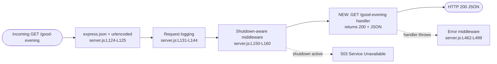

# Technical Specification

# 0. Agent Action Plan

## 0.1 Intent Clarification

### 0.1.1 Core Feature Objective

Based on the prompt, the Blitzy platform understands that the new feature requirement is to **register an additional HTTP GET endpoint on the existing Express application that responds with the greeting "Good evening"**, while also confirming that the Express.js framework is wired into the project.

Re-stated with technical precision, the user has asked for two things:

- **Requirement 1 — "add expressjs into the project"**: ensure the Express.js web framework is a declared and installed runtime dependency of the project and is actively used by the server entry point.
- **Requirement 2 — "add another endpoint that return the response of Good evening"**: define a new HTTP route on the Express application that, when invoked, returns the response payload `Good evening`.

The user's preamble describes the project as a "tutorial of node js server hosting one endpoint that returns the response 'Hello world'." The Blitzy platform has verified the actual state of the repository and surfaced the following reconciliation:

| User-Described State | Verified Repository State | Reconciliation |
|----------------------|---------------------------|----------------|
| "Tutorial node js server" | A robust Express server (`server.js`, 760 lines) named `robust-server` with comprehensive middleware, validation, graceful shutdown, and 21 Jest tests <cite index="2-3">declares a Node.js package named `robust-server`, with `server.js` as the main entry point, `npm start` mapped to `node server.js`, and `npm test` mapped to `jest`</cite> [server.js:L1-L760][package.json:L1-L29] | The repository is more elaborate than the user's mental model. The platform will treat the existing `GET /` welcome route [server.js:L292-L300] as the analog of the user's "Hello world" endpoint and will add a peer endpoint for "Good evening". |
| "One endpoint returning Hello world" | Six endpoints already exist: `GET /`, `GET /health`, `POST /api/users`, `GET /api/resources/:id`, `GET /api/items`, `GET /api/docs` <cite index="2-4">The manifest declares runtime dependencies on `express` and `express-validator`, and development dependencies on `jest` and `supertest`</cite> [server.js:L269-L429] | The new endpoint will be added without altering any of the six existing endpoints. |
| "Add expressjs into the project" | Express is **already a declared and installed runtime dependency** — `"express": "^4.21.2"` is in `package.json` [package.json:L20-L23] and resolves to exact version `4.22.1` in `package-lock.json`. `server.js` imports it at line 20 with `const express = require('express');` [server.js:L20] and instantiates `const app = express();` at line 118 [server.js:L118]. | The Express-installation requirement is **already satisfied**. No `npm install` action is required and no edits to `package.json` or `package-lock.json` are needed. The platform will proceed directly to the second requirement. |

Implicit requirements surfaced from the user's literal request:

- The new endpoint must be reachable via HTTP — it must be registered on the live `app` Express instance [server.js:L118] **before** the catch-all 404 middleware [server.js:L439-L446], because Express evaluates middleware in registration order.
- The endpoint's response shape must be consistent with the codebase's prevailing idiom. Every existing endpoint returns a JSON object [server.js:L269-L429]; therefore the new endpoint will return JSON of the form `{ message: 'Good evening', timestamp: <ISO-8601> }` rather than a raw plain-text body, mirroring the shape used by `GET /` [server.js:L292-L300].
- The new endpoint will inherit, without additional code, the upstream middleware behavior already wired into the app: JSON body parsing [server.js:L124], request logging [server.js:L131-L144], shutdown-aware gating that returns HTTP 503 during graceful shutdown [server.js:L150-L160], and downstream error capture by the four-parameter error middleware [server.js:L462-L499].
- Test coverage discipline must be maintained — the existing suite has 21 tests organized by `describe` block in `server.test.js` [server.test.js:L26-L437]. The new endpoint must be exercised by at least one additional test in the same file to keep the coverage posture consistent.
- The `/api/docs` catalog [server.js:L418-L429] is the in-process source of truth for available endpoints; adding the new entry there is required to keep the self-describing API surface honest.

### 0.1.2 Special Instructions and Constraints

- **User Example (preserved exactly):** "this is a tutorial of node js server hosting one endpoint that returns the response 'Hello world'. Could you add expressjs into the project and add another endpoint that return the response of 'Good evening'?"
- **Express-already-present constraint:** because Express is already installed at `^4.21.2` [package.json:L21], the platform must **not** re-add Express or modify the dependency manifests. Re-adding or upgrading Express is explicitly out of scope.
- **Preservation constraint:** placeholder files (`app.js`, `test.ts`, `test.js`, `test.css`, `test.html`, `test.java`, `test.py`) must remain unmodified. They are the original test-project identity markers and are not active source files — `app.js` contains only the token `dc` [app.js:L1], and the rest are empty or single-statement language samples. [inferred — preservation rationale comes from tech spec §1.2.3 critical success factors]
- **Single-file convention:** the project deliberately keeps all server code in `server.js` with section header comments rather than splitting into multiple modules [server.js:L16-L18,L47-L49,L110-L112,L162-L164,L258-L260]. The new endpoint must be added inline in `server.js`, not extracted into a separate routes module.
- **Documentation artifacts:** files under `blitzy/documentation/` are the Blitzy-generated tech specification, not runtime code, and must not be modified by this feature work. [inferred — these are tech spec artifacts, not application source]
- **No web research required:** Express routing and JSON response patterns are already idiomatic in `server.js`; the platform will follow the existing patterns directly without external research.

### 0.1.3 Technical Interpretation

These feature requirements translate to the following technical implementation strategy:

- **To satisfy "add expressjs into the project"**, we will **verify** (not install) that `express` is present in `package.json` runtime dependencies [package.json:L20-L23] and that `server.js` already imports and instantiates it [server.js:L20,L118]. No modification of dependency manifests is required.
- **To satisfy "add another endpoint that returns 'Good evening'"**, we will **modify** `server.js` by registering a new `app.get('/good-evening', handler)` route immediately after the existing `GET /api/docs` route [server.js:L418-L429] and before the 404 catch-all [server.js:L439-L446]. The handler will respond with HTTP 200 and a JSON body `{ message: 'Good evening', timestamp: new Date().toISOString() }`, mirroring the shape of the existing `GET /` welcome endpoint [server.js:L292-L300].
- **To keep the documentation catalog consistent**, we will **modify** the `endpoints` array inside the `GET /api/docs` handler [server.js:L420-L427] to append `{ method: 'GET', path: '/good-evening', description: 'Returns Good evening greeting' }`.
- **To preserve test discipline**, we will **modify** `server.test.js` by adding a new `describe('Good Evening Endpoint', ...)` block containing a single supertest-based test that asserts HTTP 200, JSON content type, and `response.body.message === 'Good evening'`, following the same supertest pattern used by the existing `Root Endpoint` describe block [server.test.js:L75-L91].

## 0.2 Repository Scope Discovery

### 0.2.1 Comprehensive File Analysis

The repository was inspected end-to-end. The table below catalogues every first-order child of the repository root with its relevance to this feature.

| Path | Type | Role in Repo | Relevance to This Feature |
|------|------|--------------|---------------------------|
| `server.js` | File | Express application entry point, 760 lines, exports `{ app, resources, startServer, gracefulShutdown, createServer, CONFIG }` [server.js:L752-L759] | **MODIFY** — register the new route and extend the `/api/docs` catalog |
| `server.test.js` | File | Jest + supertest regression suite, 21 tests across 7 `describe` blocks [server.test.js:L26-L437] | **MODIFY** — add one new test for the new endpoint |
| `package.json` | File | npm manifest; declares `express: ^4.21.2`, `express-validator: ^7.2.1`, `jest: ^29.7.0`, `supertest: ^7.1.0` [package.json:L20-L27]; main entry `server.js` [package.json:L5]; scripts `start` and `test` [package.json:L6-L9] | **REFERENCE ONLY** — no edits; Express is already present |
| `package-lock.json` | File | Pins Express to exact `4.22.1`; full transitive dependency graph | **REFERENCE ONLY** — no edits |
| `jest.config.js` | File | Jest config — `testEnvironment: 'node'`, `testMatch: ['**/*.test.js']`, `testTimeout: 10000`, `clearMocks: true`, `restoreMocks: true` [jest.config.js:L6-L13] | **REFERENCE ONLY** — already picks up `server.test.js` automatically |
| `app.js` | File | Placeholder containing only `dc` [app.js:L1] | **OUT OF SCOPE** — preserve unmodified |
| `test.ts` | File | Empty placeholder | **OUT OF SCOPE** — preserve unmodified |
| `test.js` | File | Empty placeholder | **OUT OF SCOPE** — preserve unmodified |
| `test.css` | File | Empty placeholder | **OUT OF SCOPE** — preserve unmodified |
| `test.html` | File | Empty placeholder | **OUT OF SCOPE** — preserve unmodified |
| `test.java` | File | Single-statement placeholder (`System.out.println("");`) | **OUT OF SCOPE** — preserve unmodified |
| `test.py` | File | Single-statement placeholder (`print("");`) | **OUT OF SCOPE** — preserve unmodified |
| `blitzy/` | Folder | Documentation namespace containing `documentation/Project Guide.md` and `documentation/Technical Specifications.md` | **OUT OF SCOPE** — tech spec artifacts, not application source |

Integration-point discovery inside `server.js`:

- **API endpoint registrations connecting to the feature.** The new route must be appended to the existing app's route table. The current registrations occur on the `app` instance [server.js:L118] in this order: middleware [server.js:L124-L160], validators [server.js:L170-L256], routes [server.js:L269-L429], 404 catch-all [server.js:L439-L446], error middleware [server.js:L462-L499]. The new route must be registered in the routes block, naturally placed after `GET /api/docs` [server.js:L418-L429].
- **Database models / migrations affected:** none — the project has no persistence layer; data is in-memory only.
- **Service classes requiring updates:** none — the codebase has no service layer; route handlers are inline in `server.js`.
- **Controllers / handlers to modify:** the only handler that needs updating beyond the new route is the `/api/docs` handler [server.js:L418-L429], whose static `endpoints` array enumerates available endpoints for the in-process documentation catalog.
- **Middleware / interceptors impacted:** none — the existing middleware chain (body parsing [server.js:L124-L125], request logging [server.js:L131-L144], shutdown-aware gate [server.js:L150-L160], error middleware [server.js:L462-L499]) automatically applies to the new route by virtue of its position in the middleware order.

### 0.2.2 Web Search Research Conducted

No web research was required for this feature. The Express routing pattern (`app.get(path, handler)`) and the JSON response idiom (`res.status(200).json({...})`) are already established and demonstrated multiple times in the existing codebase [server.js:L269,L292,L312,L345,L376,L418]. The new endpoint follows these in-repo patterns directly.

### 0.2.3 New File Requirements

**No new files need to be created.** This feature is small enough to fit inside the existing single-file server convention [server.js:L16-L18]. Creating separate modules for a single route would violate the codebase's deliberate single-file organization. All work occurs by editing `server.js` and `server.test.js`.

## 0.3 Dependency Inventory

**No dependency changes are required for this feature.** Express.js — the only package referenced in the user's request — is already a declared runtime dependency at `^4.21.2` and is pinned to exact version `4.22.1` in the lockfile [package.json:L20-L23]. `server.js` already imports and instantiates Express [server.js:L20,L118].

The user's literal phrasing "add expressjs into the project" is therefore a no-op against the current state of the repository. The platform will not modify `package.json`, `package-lock.json`, or run `npm install` for any new package. The relevant dependencies are summarized below for confirmation, with no changes proposed.

| Registry | Package | Declared Range | Resolved Version | Purpose | Action |
|----------|---------|----------------|------------------|---------|--------|
| npm | `express` | `^4.21.2` [package.json:L21] | `4.22.1` (lockfile) | HTTP routing framework — required by both the existing endpoints and the new `/good-evening` route | **No change** — already installed |

No imports need to be transformed and no external configuration files (e.g., `.config.*`, `*.md`, `.github/workflows/*.yml`) need to be updated, because no module boundaries are being introduced or moved.

## 0.4 Integration Analysis

### 0.4.1 Existing Code Touchpoints

The new endpoint integrates with the existing application at exactly two functional touchpoints in `server.js`, plus one test-suite touchpoint in `server.test.js`. There are no database, dependency-injection, or schema changes.

| Touchpoint | Location | Change Required |
|------------|----------|-----------------|
| New route registration | `server.js`, between line 429 (end of `/api/docs` handler) and line 439 (start of 404 catch-all) [server.js:L418-L446] | INSERT a new `app.get('/good-evening', handler)` block following the same handler shape as `GET /` [server.js:L292-L300] |
| Documentation catalog | `server.js:L420-L427` — the static `endpoints` array inside the `GET /api/docs` handler | APPEND one entry: `{ method: 'GET', path: '/good-evening', description: 'Returns Good evening greeting' }` |
| Regression test suite | `server.test.js`, anywhere inside the top-level `describe('Robust Server.js Test Suite', ...)` [server.test.js:L26-L437] | ADD a new `describe('Good Evening Endpoint', ...)` block with one test that asserts HTTP 200, JSON content type, and `body.message === 'Good evening'` |

### 0.4.2 Implicit Middleware Integration

The new route does **not** require additional middleware wiring — it inherits the full upstream middleware chain automatically by virtue of being registered on the same `app` instance after the global middleware blocks. This Mermaid diagram shows where the new route fits in the request flow:


```mermaid
flowchart LR
    Req([Incoming GET /good-evening]) --> BP[express.json + urlencoded<br/>server.js:L124-L125]
    BP --> LG[Request logging<br/>server.js:L131-L144]
    LG --> SA[Shutdown-aware middleware<br/>server.js:L150-L160]
    SA --> GE[NEW: GET /good-evening handler<br/>returns 200 + JSON]
    GE --> Resp([HTTP 200 JSON])
    SA -.shutdown active.-> SD[503 Service Unavailable]
    GE -.handler throws.-> EM[Error middleware<br/>server.js:L462-L499]
```

Specifically:

- **JSON / urlencoded body parsing** [server.js:L124-L125] runs for every request including the new route, even though `GET /good-evening` carries no body — this is a no-op for the new route.
- **Request logging middleware** [server.js:L131-L144] will log the new route's requests and response status codes using the existing `[timestamp] METHOD URL - STATUS` format.
- **Shutdown-aware middleware** [server.js:L150-L160] will automatically return HTTP 503 for `GET /good-evening` while `resources.isShuttingDown === true`, matching every other endpoint's shutdown semantics.
- **Error-handling middleware** [server.js:L462-L499] will automatically capture any synchronous exception thrown from the new handler and serialize it into the standard `{ success: false, error, message, timestamp }` envelope.
- **404 catch-all** [server.js:L439-L446] must remain registered **after** the new route, otherwise the new path would be shadowed and return 404. The insertion point between line 429 and line 439 preserves this ordering.

### 0.4.3 Non-Integrations

The following systems are **not** touched by this feature: dependency-injection containers (none exist in this project), database migrations (no database), schema files (no schema), service classes (no service layer), authentication / authorization middleware (none exists; out of scope per tech spec §1.2.1), and configuration files such as `.env*` (no new environment variables introduced).

## 0.5 Technical Implementation

### 0.5.1 File-by-File Execution Plan

Every file listed below MUST be created, modified, or referenced exactly as described. Files marked REFERENCE are inspected but not edited.

**Group 1 — Core Feature Route Registration**

| Mode | Path | Action |
|------|------|--------|
| UPDATE | `server.js` | Insert a new `app.get('/good-evening', handler)` block between the existing `GET /api/docs` route [server.js:L418-L429] and the 404 catch-all handler [server.js:L439-L446]. The handler responds with HTTP 200 and a JSON body `{ message: 'Good evening', timestamp: new Date().toISOString() }`, mirroring the response shape of `GET /` [server.js:L292-L300]. |

Reference implementation snippet (target shape; do not commit verbatim without integration):

```javascript
app.get('/good-evening', (req, res) => {
  res.status(200).json({
    message: 'Good evening',
    timestamp: new Date().toISOString()
  });
});
```

**Group 2 — Documentation Catalog Consistency**

| Mode | Path | Action |
|------|------|--------|
| UPDATE | `server.js` | Append one entry to the `endpoints` array inside the `GET /api/docs` handler [server.js:L420-L427]: `{ method: 'GET', path: '/good-evening', description: 'Returns Good evening greeting' }`. This keeps the in-process API catalog consistent with the actual registered routes, matching the pattern of the existing five enumerated endpoints [server.js:L422-L426]. |

**Group 3 — Regression Test Coverage**

| Mode | Path | Action |
|------|------|--------|
| UPDATE | `server.test.js` | Add a new `describe('Good Evening Endpoint', ...)` block inside the top-level suite [server.test.js:L26], structured identically to the existing `describe('Root Endpoint', ...)` block [server.test.js:L75-L91]. The block contains one `test('should return 200 with "Good evening" message', ...)` that uses `request(app).get('/good-evening').expect(200).expect('Content-Type', /json/)` and asserts `response.body.message === 'Good evening'` and that `response.body.timestamp` is a non-empty ISO-8601 string. |

Reference test snippet (target shape):

```javascript
describe('Good Evening Endpoint', () => {
  test('should return 200 with Good evening message', async () => {
    const response = await request(app)
      .get('/good-evening')
      .expect(200)
      .expect('Content-Type', /json/);
    expect(response.body.message).toBe('Good evening');
  });
});
```

**Group 4 — Reference-Only Files (No Modification)**

| Mode | Path | Reason |
|------|------|--------|
| REFERENCE | `package.json` | Confirms Express is already a declared dependency at `^4.21.2` [package.json:L20-L23]; no edits needed |
| REFERENCE | `package-lock.json` | Confirms Express resolves to exact version `4.22.1`; no edits needed |
| REFERENCE | `jest.config.js` | Confirms test runner picks up `**/*.test.js` [jest.config.js:L8]; the modified `server.test.js` is auto-discovered without configuration change |

### 0.5.2 Implementation Approach per File

- **`server.js`** — Open the file, navigate to the routes section delimited by the comment block `// API ROUTES WITH VALIDATION` [server.js:L258-L260]. Locate the `/api/docs` handler that ends at line 429. Insert the new route registration block immediately after this handler and immediately before the 404 catch-all comment block at line 431 (`// 404 HANDLER FOR UNDEFINED ROUTES`). Use the same JSDoc-comment style that precedes every other route handler [server.js:L262-L268,L285-L291] to document the route. Then update the `endpoints` array inside the `/api/docs` handler [server.js:L420-L427] to append the new entry — maintain alphabetical-or-source-order consistency by appending it at the end of the array, matching how existing entries appear in source order.
- **`server.test.js`** — Open the file, navigate to the top-level `describe('Robust Server.js Test Suite', ...)` block [server.test.js:L26]. Insert the new `describe('Good Evening Endpoint', ...)` block between the existing `Root Endpoint` describe [server.test.js:L75-L91] and the next describe block, or append it at the end of the suite before the closing brace [server.test.js:L437]. Use the existing supertest invocation pattern `request(app).get(...).expect(...)` already demonstrated by the root-endpoint test [server.test.js:L80-L90].
- **`package.json`, `package-lock.json`, `jest.config.js`** — these files are read only to confirm preconditions; no writes are performed.

### 0.5.3 User Interface Design

NOT APPLICABLE. This is a server-only HTTP API project [tech spec §1.2.2] with no rendering layer, no front-end framework, no Figma artifacts, no design tokens, and no component library. The user provided no UI requirements. Endpoint responses are JSON payloads consumed programmatically by HTTP clients.

## 0.6 Scope Boundaries

### 0.6.1 Exhaustively In Scope

- **Express application source file:**
    - `server.js` — register the new `GET /good-evening` route and extend the `/api/docs` `endpoints` array
- **Regression test file:**
    - `server.test.js` — add one `describe` block with one test for the new endpoint

That is the complete in-scope file list. No other files in the repository require modification to satisfy the user's request.

### 0.6.2 Explicitly Out of Scope

- **Dependency manifests:**
    - `package.json` — no edits; Express is already declared at `^4.21.2` [package.json:L20-L23]
    - `package-lock.json` — no edits; Express is already resolved to `4.22.1`
- **Test runner configuration:**
    - `jest.config.js` — no edits; existing `testMatch` already covers `server.test.js` [jest.config.js:L8]
- **All placeholder files (must remain unmodified):**
    - `app.js`, `test.ts`, `test.js`, `test.css`, `test.html`, `test.java`, `test.py` — these are intentional test-project identity markers; modifying them violates the preservation rule documented in tech spec §1.2.3
- **All documentation artifacts:**
    - `blitzy/documentation/Project Guide.md`, `blitzy/documentation/Technical Specifications.md` — these are tech spec assets, not application source
- **Refactoring or restructuring:**
    - No extraction of routes into a separate routes module — the project deliberately uses a single-file pattern [server.js:L16-L18]
    - No introduction of services, controllers, repositories, or a database layer — none currently exist [tech spec §1.2.1]
- **Behavior changes to existing endpoints:**
    - `GET /`, `GET /health`, `POST /api/users`, `GET /api/resources/:id`, `GET /api/items`, `GET /api/docs` must continue to function exactly as today (zero regressions)
    - The existing 21-test Jest suite must continue to pass without modification of its current assertions
- **Cross-cutting concerns not requested by the user:**
    - No authentication, authorization, rate limiting, CORS, TLS configuration, structured logging, OpenAPI/Swagger generation, or persistence
    - No new environment variables, configuration options, or CLI flags
    - No performance, profiling, or observability instrumentation beyond what the existing request-logging middleware already provides [server.js:L131-L144]
- **Renaming or repurposing the existing `GET /` endpoint:**
    - The user's preamble mentions a "Hello world" endpoint that does not literally exist in the repository (the existing `GET /` returns a JSON welcome message [server.js:L292-L300]). The Blitzy platform will neither rename, alter, nor replace the existing root endpoint to make it return "Hello world" — only the new `GET /good-evening` endpoint will be added.

## 0.7 Rules for Feature Addition

The user did not provide an explicit rules list (the implementation-rules array is `[]`). The platform has nonetheless derived the following implicit rules from the repository's established conventions, which the implementing agent must honor.

- **Follow the established single-file convention.** All server code lives in `server.js` with section-header comments delimiting logical blocks [server.js:L16-L18,L47-L49,L110-L112,L162-L164,L258-L260]. Do not introduce new modules, folders, or extract routes into separate files for this feature.
- **Match the existing JSON response idiom.** Every existing route handler returns a JSON object via `res.status(N).json({...})` [server.js:L269-L429]. The new endpoint must return JSON, not plain text — return `{ message: 'Good evening', timestamp: <ISO-8601> }` to match the shape of `GET /` [server.js:L292-L300].
- **Preserve registration order.** Express evaluates middleware and routes in registration order. Register the new route after all existing routes but before the 404 catch-all [server.js:L439-L446], otherwise it will be unreachable.
- **Use the existing JSDoc style for the route.** Every existing route handler is preceded by a JSDoc comment block specifying `@route`, response shape, and a short description [server.js:L262-L268,L285-L291,L302-L311,L337-L344,L367-L375,L412-L417]. The new route must follow the same convention.
- **Keep the `/api/docs` catalog truthful.** When a new route is added, the `endpoints` array inside the `/api/docs` handler [server.js:L420-L427] must be updated in the same change so the self-describing documentation surface remains consistent with the actual route table.
- **Maintain the existing supertest pattern in tests.** The Jest suite uses `request(app).METHOD(path).expect(...)` for every test [server.test.js:L37-L46,L80-L90]. The new test must follow the same pattern, must live in `server.test.js`, and must keep the file's existing `describe`-block organization.
- **Preserve test-project identity files.** The placeholder files (`app.js`, `test.ts`, `test.js`, `test.css`, `test.html`, `test.java`, `test.py`) and the `blitzy/documentation/` folder must remain untouched. [inferred — derived from tech spec §1.2.3 critical success factors]
- **No new external dependencies.** Express is already installed; do not add additional npm packages for this feature.

## 0.8 References

### 0.8.1 Citation Catalog

All claims in this Agent Action Plan about the existing system are grounded in the following repository locations. Citations elsewhere in the AAP use the `[path:locator]` form pointing at these sources.

| Source Location | Claim(s) Supported |
|-----------------|--------------------|
| `server.js:L1-L760` | The repository contains a full-featured Express server with six endpoints, validation, graceful shutdown, and error handling |
| `server.js:L20` | Express is imported (`const express = require('express');`) |
| `server.js:L21` | `express-validator` is imported |
| `server.js:L118` | The Express `app` instance is created (`const app = express();`) |
| `server.js:L124-L125` | JSON and URL-encoded body parsing middleware are registered globally |
| `server.js:L131-L144` | Request-logging middleware is registered globally |
| `server.js:L150-L160` | Shutdown-aware middleware is registered globally and returns HTTP 503 during shutdown |
| `server.js:L269-L283` | `GET /health` endpoint definition |
| `server.js:L292-L300` | `GET /` welcome endpoint definition — reference shape for the new endpoint |
| `server.js:L312-L335` | `POST /api/users` endpoint definition |
| `server.js:L345-L365` | `GET /api/resources/:id` endpoint definition |
| `server.js:L376-L410` | `GET /api/items` endpoint definition |
| `server.js:L418-L429` | `GET /api/docs` endpoint definition; the `endpoints` array to be extended lives at L420-L427 |
| `server.js:L439-L446` | 404 catch-all middleware — the new route must be registered before this |
| `server.js:L462-L499` | Global error-handling middleware (four-parameter Express error handler) |
| `server.js:L752-L759` | Module exports include `app`, used by supertest in `server.test.js` |
| `server.test.js:L19-L20` | Test suite imports `supertest` and the exported `app` from `server.js` |
| `server.test.js:L26` | Top-level `describe('Robust Server.js Test Suite', ...)` block |
| `server.test.js:L75-L91` | `Root Endpoint` describe block — reference shape for the new test |
| `server.test.js:L37-L46` | Existing supertest invocation pattern with `.expect(200).expect('Content-Type', /json/)` |
| `package.json:L5` | `main` entry is `server.js` |
| `package.json:L6-L9` | `start` script is `node server.js`; `test` script is `jest` |
| `package.json:L20-L23` | Runtime dependencies: `express: ^4.21.2`, `express-validator: ^7.2.1` |
| `package.json:L24-L27` | Dev dependencies: `jest: ^29.7.0`, `supertest: ^7.1.0` |
| `package-lock.json` (Express entry) | Express resolves to exact version `4.22.1` |
| `jest.config.js:L6-L13` | Jest configuration — node environment, `testMatch: ['**/*.test.js']`, 10s timeout |
| `app.js:L1` | Placeholder file containing only `dc` |
| Tech Spec §1.2 SYSTEM OVERVIEW | Project context, runtime versions, single-file rationale, and critical success factors including preservation of placeholder files |
| Tech Spec §2.2 HTTP ENDPOINT FEATURES | Detailed catalog of the six existing endpoints used to derive consistency rules |
| Tech Spec §2.8 FEATURE RELATIONSHIPS | Middleware chain order and shared-component map confirming the new route inherits the global middleware stack |

### 0.8.2 Attachments

No attachments were provided with the user's request. The user uploaded zero files, zero Figma frames, and zero external URLs.

| Attachment Type | Filename / URL | Summary |
|-----------------|----------------|---------|
| Document | — | None provided |
| Image | — | None provided |
| Figma Frame | — | None provided |
| External Link | — | None provided |

### 0.8.3 Figma Screens

NOT APPLICABLE. No Figma URLs were attached to this request. This is a server-only project with no UI surface.

### 0.8.4 Search Log Appendix

The following exhaustive search activity supports the conclusions above.

| # | Tool | Target | Purpose |
|---|------|--------|---------|
| 1 | bash | `find / -maxdepth 6 -name ".blitzyignore"` | Confirm no ignore patterns are defined (none found) |
| 2 | bash | `node --version`, `npm --version` | Verify runtime availability (Node v22.22.2, npm 11.1.0) |
| 3 | get_source_folder_contents | `` (repo root) | Enumerate top-level files and folders |
| 4 | read_file | `package.json` | Capture declared dependencies and scripts |
| 5 | read_file | `server.js` (full) | Map all routes, middleware, shutdown logic, exports |
| 6 | read_file | `server.test.js` (full) | Understand test discipline and identify insertion point |
| 7 | read_file | `jest.config.js` | Confirm test discovery rules |
| 8 | read_file | `app.js` | Confirm placeholder status (contains only `dc`) |
| 9 | bash | `cat test.ts test.js test.css test.html test.java test.py` | Confirm placeholder status of language-sample files |
| 10 | bash | `grep -nE "app\\.(get\|post\|put\|delete\|use)" server.js` | Enumerate all route and middleware registration points |
| 11 | bash | Resolve Express lockfile entry via `node -e` | Confirm Express pinned at `4.22.1` |
| 12 | get_source_folder_contents | `blitzy` | Confirm folder contains only `documentation/` |
| 13 | get_tech_spec_section | `1.2 SYSTEM OVERVIEW` | Project context and critical success factors |
| 14 | get_tech_spec_section | `2.2 HTTP ENDPOINT FEATURES` | Detailed shape of every existing endpoint |
| 15 | get_tech_spec_section | `2.8 FEATURE RELATIONSHIPS` | Middleware chain ordering and shared components |

